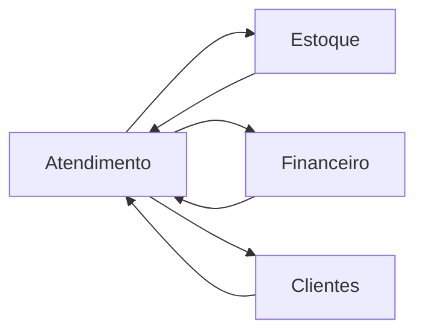

# Componentes do Sistema

## 🏗️ Componentes Principais

### 1. Módulo de Atendimento
**Responsabilidade**: Gerenciar o ciclo de vida das Ordens de Serviço

**Componentes**:
- OrdemServicoController
- OrdemServicoService
- OrdemServicoRepository
- OrdemServico (Aggregate)

**Funcionalidades**:
- Abertura de OS
- Acompanhamento de status
- Histórico de atendimentos

### 2. Módulo de Clientes
**Responsabilidade**: Gestão de dados e relacionamento com clientes

**Componentes**:
- ClienteController
- ClienteService
- ClienteRepository
- Cliente (Entity)

**Funcionalidades**:
- CRUD de clientes
- Histórico de serviços
- Análise de perfil

### 3. Módulo de Estoque
**Responsabilidade**: Controle de peças e insumos

**Componentes**:
- EstoqueController
- EstoqueService
- EstoqueRepository
- Peca (Entity)

**Funcionalidades**:
- Controle de quantidade
- Reservas e baixas
- Compras automáticas

### 4. Módulo Financeiro
**Responsabilidade**: Gestão financeira do negócio

**Componentes**:
- PagamentoController
- PagamentoService
- PagamentoRepository
- Pagamento (Entity)

**Funcionalidades**:
- Processamento de pagamentos
- Faturamento
- Relatórios financeiros

## 🔄 Integração entre Componentes

## 📊 Métricas e Monitoramento

Cada componente expõe métricas específicas:
- Tempo de resposta
- Taxa de erro
- Volume de requisições
- Uso de recursos

---

*Esta seção será detalhada com diagramas de componentes e especificações técnicas.*
