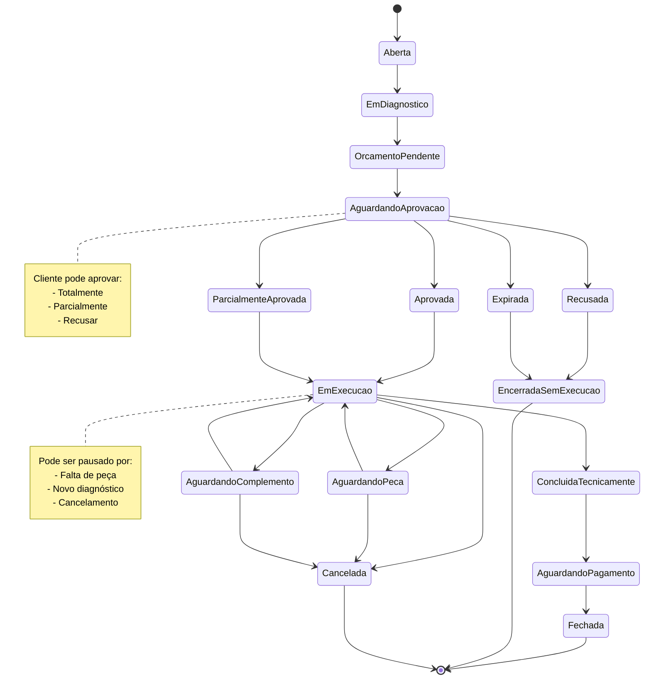
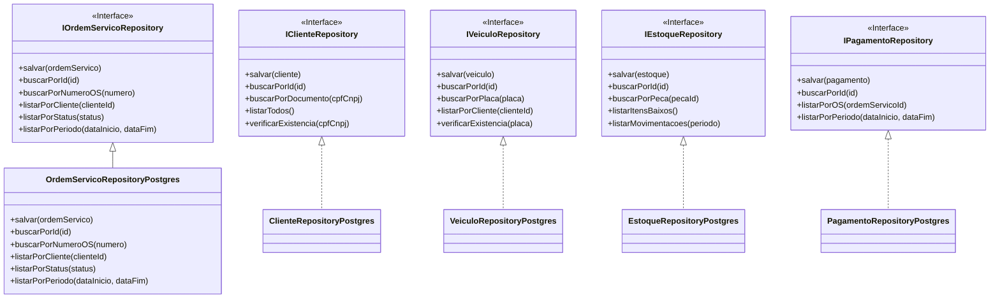
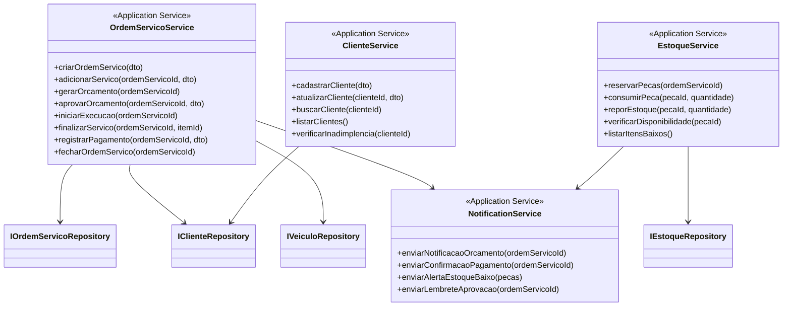
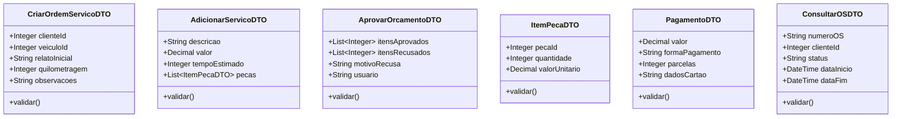
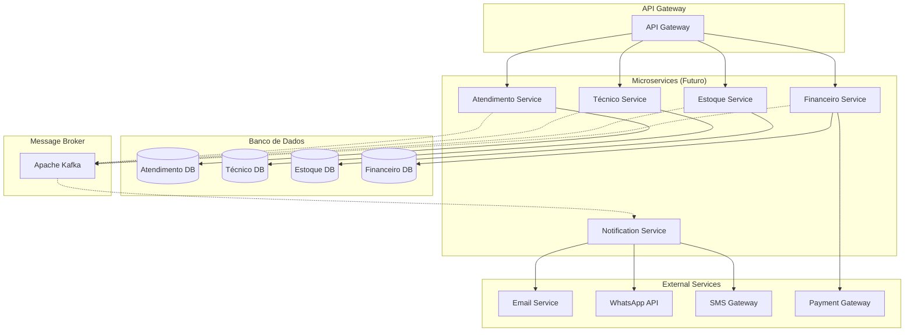
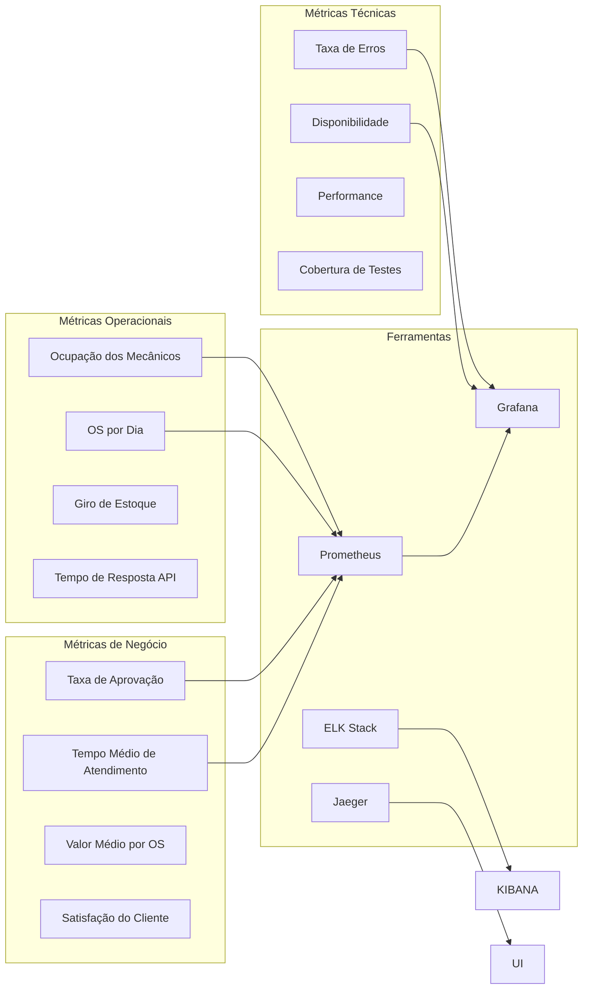

# Diagramas Domain-Driven Design

## 🎯 Visão Geral dos Diagramas

Os diagramas DDD representam a arquitetura e o design do sistema da oficina mecânica, seguindo os princípios do Domain-Driven Design para garantir que a solução tecnológica reflita fielmente as complexidades do negócio.

## 🏗️ Diagrama de Contexto Delimitado (Bounded Context)

```mermaid
graph TB
    subgraph "Contexto de Atendimento"
        OS[Ordem Serviço]
        CLI[Cliente]
        VEC[Veículo]
        REC[Recepção]
    end
    
    subgraph "Contexto Técnico"
        DIAG[Diagnóstico]
        SERV[Serviço]
        MEC[Mecânico]
        CHECK[Checklist]
    end
    
    subgraph "Contexto de Estoque"
        PEC[Peça]
        EST[Estoque]
        MOV[Movimentação]
        FORN[Fornecedor]
    end
    
    subgraph "Contexto Financeiro"
        ORC[Orçamento]
        PAG[Pagamento]
        FAT[Faturamento]
        COB[Cobrança]
    end
    
    subgraph "Contexto de Comunicação"
        NOT[Notificação]
        EMAIL[E-mail]
        WHATS[WhatsApp]
        SMS[SMS]
    end
    
    OS -.-> ORC
    OS -.-> PEC
    ORC -.-> PAG
    SERV -.-> PEC
    CLI -.-> NOT
    OS -.-> NOT
    
    style "Contexto de Atendimento" fill:#e1f5fe
    style "Contexto Técnico" fill:#f3e5f5
    style "Contexto de Estoque" fill:#e8f5e8
    style "Contexto Financeiro" fill:#fff3e0
    style "Contexto de Comunicação" fill:#fce4ec
```

### Relacionamentos entre Contextos

| Contexto | Relacionamento | Tipo de Integração |
|----------|----------------|-------------------|
| **Atendimento → Financeiro** | Envia dados da OS para orçamento | **Domain Events** |
| **Atendimento → Estoque** | Solicita peças para serviços | **Synchronous API** |
| **Técnico → Estoque** | Consome peças durante execução | **Domain Events** |
| **Financeiro → Comunicação** | Dispara notificações de pagamento | **Events** |
| **Estoque → Atendimento** | Notifica falta de peças | **Events** |

## 🎯 Diagrama de Aggregates

```mermaid
classDiagram
    class OrdemServico {
        <<Aggregate Root>>
        +String numeroOS
        +Status status
        +DateTime dataEntrada
        +String relatoInicial
        +Integer quilometragem
        +abrir()
        +iniciarDiagnostico()
        +gerarOrcamento()
        +aprovarOrcamento()
        +iniciarExecucao()
        +finalizar()
        +cancelar()
    }
    
    class ItemServico {
        <<Entity>>
        +String descricao
        +StatusItem status
        +Decimal valor
        +Integer tempoEstimado
        +iniciar()
        +pausar()
        +concluir()
        +cancelar()
    }
    
    class Orcamento {
        <<Entity>>
        +Decimal valorTotal
        +StatusOrcamento status
        +DateTime validade
        +List~ItemOrcamento~ itens
        +calcularTotal()
        +validarAprovacao()
        +expirar()
    }
    
    class ChecklistFinal {
        <<Entity>>
        +Boolean todosItensConcluidos
        +Boolean veiculoLimpo
        +Boolean semPendencias
        +DateTime dataRealizacao
        +realizar()
        +validar()
    }
    
    class HistoricoEvento {
        <<Entity>>
        +String tipoEvento
        +String descricao
        +DateTime dataHora
        +String usuario
        +registrar()
    }
    
    OrdemServico ||--o{ ItemServico : contem
    OrdemServico ||--|| Orcamento : possui
    OrdemServico ||--|| ChecklistFinal : possui
    OrdemServico ||--o{ HistoricoEvento : registra
```

## 🔧 Diagrama de Entidades e Value Objects

```mermaid
classDiagram
    class Cliente {
        <<Entity>>
        +String nome
        +Documento documento
        +Telefone telefone
        +Email email
        +Endereco endereco
        +TipoCliente tipo
        +validar()
        +estaInadimplente()
    }
    
    class Documento {
        <<Value Object>>
        +String valor
        +TipoDocumento tipo
        +validar()
        +formatar()
    }
    
    class Telefone {
        <<Value Object>>
        +String ddd
        +String numero
        +TipoTelefone tipo
        +validar()
        +formatar()
    }
    
    class Email {
        <<Value Object>>
        +String endereco
        +validar()
    }
    
    class Endereco {
        <<Value Object>>
        +String rua
        +String numero
        +String bairro
        +String cidade
        +String estado
        +String cep
        +formatar()
    }
    
    class Veiculo {
        <<Entity>>
        +Placa placa
        +String marca
        +String modelo
        +Integer ano
        +String cor
        +String chassi
        +Integer quilometragem
        +validar()
        +atualizarQuilometragem()
    }
    
    class Placa {
        <<Value Object>>
        +String valor
        +validar()
        +formatar()
    }
    
    Cliente ||--o{ Veiculo : possui
    Cliente *-- Documento : possui
    Cliente *-- Telefone : possui
    Cliente *-- Email : possui
    Cliente *-- Endereco : possui
    Veiculo *-- Placa : possui
```

## 🏪 Diagrama do Contexto de Estoque

```mermaid
classDiagram
    class Estoque {
        <<Aggregate Root>>
        +String id
        +List~ItemEstoque~ itens
        +verificarDisponibilidade()
        +reservar()
        +baixar()
        +repor()
        +calcularValorTotal()
    }
    
    class ItemEstoque {
        <<Entity>>
        +Peca peca
        +Integer quantidade
        +Integer quantidadeMinima
        +Decimal valorUnitario
        +verificarEstoqueBaixo()
        +reservar()
        +baixar()
    }
    
    class Peca {
        <<Entity>>
        +String codigo
        +String nome
        +String descricao
        +CategoriaPeca categoria
        +String fornecedor
        +Integer tempoReposicao
        +validar()
    }
    
    class MovimentacaoEstoque {
        <<Entity>>
        +TipoMovimentacao tipo
        +Integer quantidade
        +String motivo
        +OrdemServico ordemServico
        +DateTime dataMovimentacao
        +String responsavel
        +registrar()
    }
    
    Estoque ||--o{ ItemEstoque : contem
    ItemEstoque ||--|| Peca : referencia
    Estoque ||--o{ MovimentacaoEstoque : gera
```

## 💳 Diagrama do Contexto Financeiro

```mermaid
classDiagram
    class Pagamento {
        <<Aggregate Root>>
        +String id
        +OrdemServico ordemServico
        +Decimal valor
        +StatusPagamento status
        +FormaPagamento forma
        +DateTime dataPagamento
        +registrar()
        +confirmar()
        +cancelar()
    }
    
    class FormaPagamento {
        <<Value Object>>
        +TipoForma tipo
        +String descricao
        +Decimal valor
        +Integer parcelas
        +validar()
    }
    
    class Fatura {
        <<Entity>>
        +String numero
        +DateTime emissao
        +DateTime vencimento
        +Decimal valor
        +StatusFatura status
        +gerar()
        +vencer()
        +cancelar()
    }
    
    class Cobranca {
        <<Entity>>
        +String id
        +Cliente cliente
        +Decimal valor
        +DateTime dataVencimento
        +StatusCobranca status
        +gerarBoleto()
        +enviarNotificacao()
    }
    
    Pagamento *-- FormaPagamento : possui
    Pagamento ||--|| Fatura : gera
    Pagamento ||--o{ Cobranca : podeGerar
```

## 🔄 Diagrama de Domain Events

```mermaid
flowchart TD
    subgraph "Eventos de Atendimento"
        E1[OSCriada]
        E2[ClienteCadastrado]
        E3[VeiculoRecebido]
        E4[OSEncerrada]
    end
    
    subgraph "Eventos Técnicos"
        E5[DiagnosticoConcluido]
        E6[ServicoIniciado]
        E7[ServicoConcluido]
        E8[ChecklistRealizado]
    end
    
    subgraph "Eventos Financeiros"
        E9[OrcamentoGerado]
        E10[OrcamentoAprovado]
        E11[PagamentoRegistrado]
        E12[FaturaEmitida]
    end
    
    subgraph "Eventos de Estoque"
        E13[PecaReservada]
        E14[PecaConsumida]
        E15[EstoqueBaixo]
        E16[MovimentacaoRegistrada]
    end
    
    subgraph "Eventos de Comunicação"
        E17[NotificacaoEnviada]
        E18[EmailEnviado]
        E19[WhatsAppEnviado]
        E20[SMSEnviado]
    end
    
    E1 --> E5
    E5 --> E9
    E9 --> E17
    E10 --> E6
    E6 --> E13
    E6 --> E14
    E7 --> E8
    E8 --> E11
    E11 --> E12
    E12 --> E4
    
    style "Eventos de Atendimento" fill:#e1f5fe
    style "Eventos Técnicos" fill:#f3e5f5
    style "Eventos Financeiros" fill:#fff3e0
    style "Eventos de Estoque" fill:#e8f5e8
    style "Eventos de Comunicação" fill:#fce4ec
```

## 📊 Diagrama de Estados da Ordem de Serviço



## 🔗 Diagrama de Repositories



## 🎯 Diagrama de Application Services



## 📋 Diagrama de DTOs (Data Transfer Objects)



## 🔄 Diagrama de Integração entre Sistemas



## 📊 Métricas e Monitoramento



---

Estes diagramas DDD fornecem uma visão completa da arquitetura do sistema, garantindo que todos os aspectos do domínio da oficina mecânica sejam adequadamente representados e que a implementação siga as melhores práticas de Domain-Driven Design.
