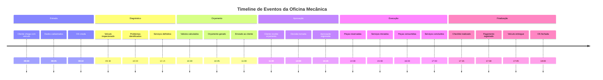
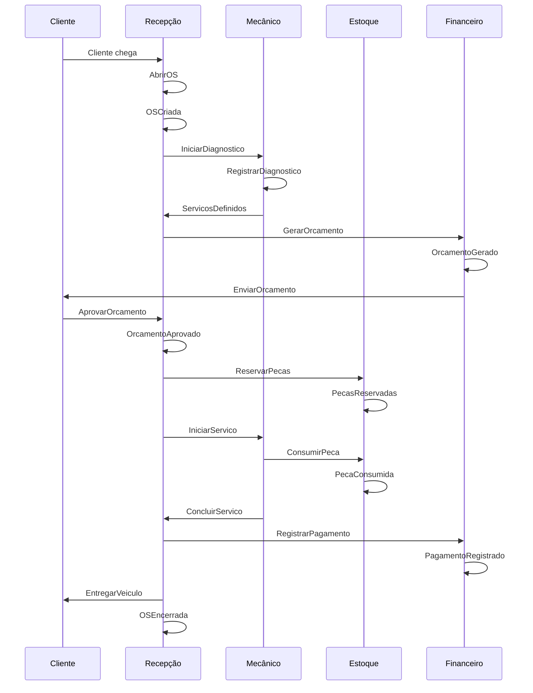
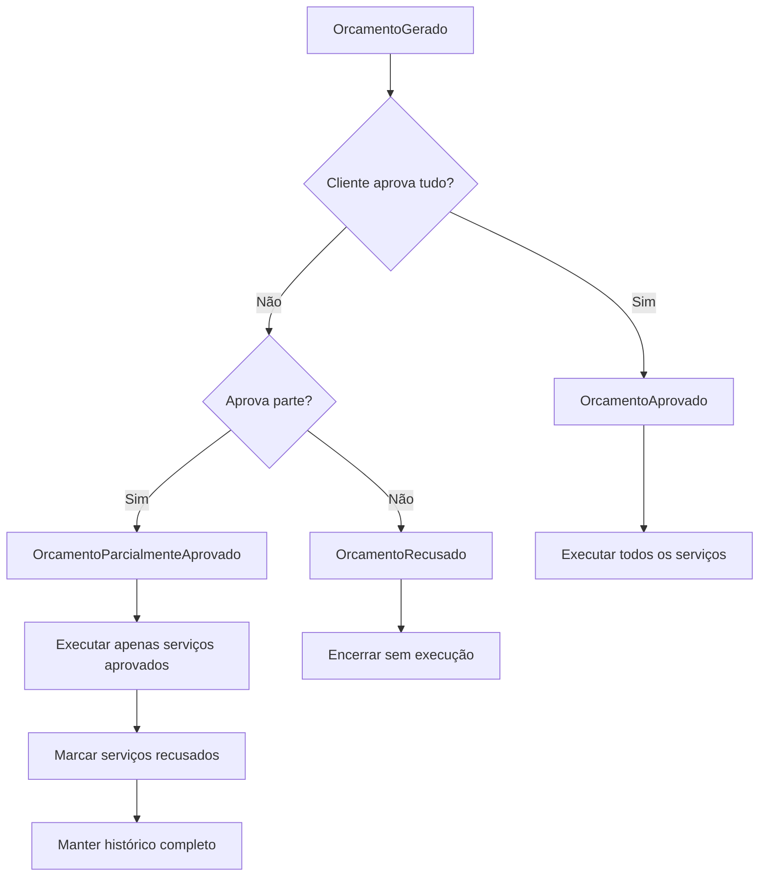
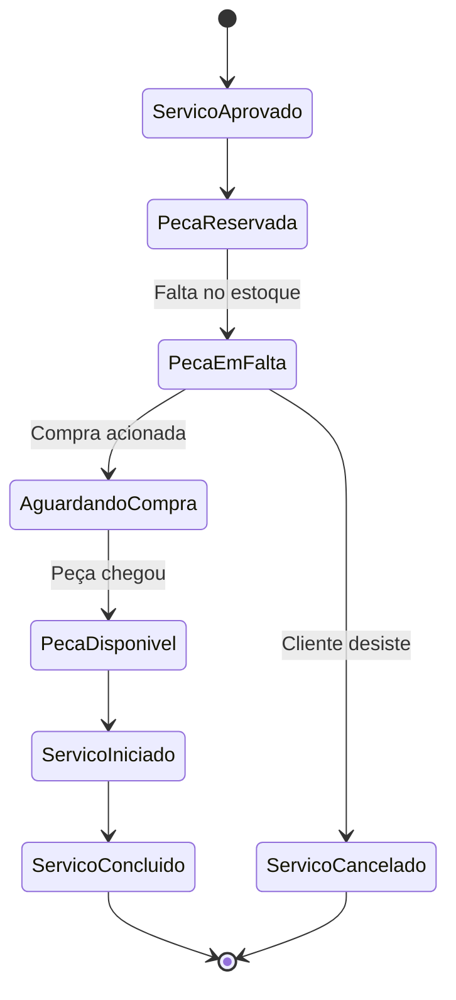
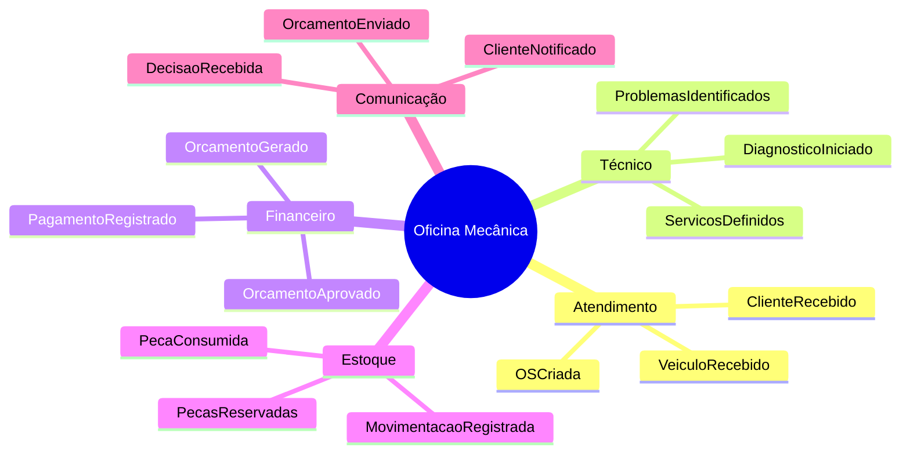

# Event Storming

## 🌊 O que é Event Storming?

**Event Storming** é uma técnica facilitada de modelagem de domínio que utiliza post-its para mapear eventos de negócio em ordem cronológica. Esta abordagem nos ajuda a entender o fluxo complexo de uma oficina mecânica e identificar os dominíos, agregados e eventos do sistema.

## 🎯 Objetivo do Event Storming

Mapear todos os eventos importantes que ocorrem no domínio da oficina mecânica, desde a entrada de um veículo até sua entrega, identificando:

- ✅ **Domain Events**: O que acontece no sistema
- ✅ **Commands**: O que dispara os eventos  
- ✅ **Aggregates**: Quem orquestra as operações
- ✅ **Read Models**: O que os usuários precisam ver
- ✅ **Bounded Contexts**: Fronteiras do domínio

## 📋 Mapeamento de Eventos

### Timeline Principal do Processo

## 🎨 Mapa de Event Storming Completo

### Eventos de Domínio (Laranja 🟠)

| Evento | Contexto | Descrição |
|--------|----------|-----------|
| **ClienteChegou** | Atendimento | Cliente chega à oficina com veículo |
| **DadosCadastrados** | Atendimento | Informações de cliente/veículo registradas |
| **OSCriada** | Atendimento | Nova ordem de serviço aberta |
| **VeiculoRecebido** | Atendimento | Veículo正式mente recebido pela oficina |
| **DiagnosticoIniciado** | Técnico | Mecânico começa inspeção do veículo |
| **ProblemasIdentificados** | Técnico | Issues encontradas durante diagnóstico |
| **ServicosDefinidos** | Técnico | Serviços necessários determinados |
| **PecasNecessariasIdentificadas** | Estoque | Peças requeridas identificadas |
| **OrcamentoCalculado** | Financeiro | Valores totais calculados |
| **OrcamentoGerado** | Financeiro | Documento de orçamento criado |
| **OrcamentoEnviado** | Comunicação | Orçamento enviado ao cliente |
| **ClienteNotificado** | Comunicação | Cliente contatado sobre orçamento |
| **DecisaoRecebida** | Atendimento | Resposta do cliente recebida |
| **OrcamentoAprovado** | Financeiro | Orçamento aprovado pelo cliente |
| **OrcamentoParcialmenteAprovado** | Financeiro | Parte dos serviços aprovada |
| **OrcamentoRecusado** | Financeiro | Orçamento rejeitado pelo cliente |
| **PecasReservadas** | Estoque | Peças separadas para a OS |
| **ServicosIniciados** | Técnico | Execução dos serviços começou |
| **PecaConsumida** | Estoque | Peça baixada do estoque |
| **ServicoConcluido** | Técnico | Serviço específico finalizado |
| **TodosServicosConcluidos** | Técnico | Todos os serviços aprovados finalizados |
| **ChecklistRealizado** | Qualidade | Verificação final executada |
| **PagamentoRegistrado** | Financeiro | Pagamento confirmado |
| **VeiculoLiberado** | Atendimento | Veículo liberado para entrega |
| **OSEncerrada** | Atendimento | Processo finalizado com sucesso |

### Commands (Azul 🔵)

| Command | Trigger | Aggregate |
|---------|---------|-----------|
| **AbrirOS** | Cliente chega | OrdemServico |
| **IniciarDiagnostico** | OS criada | OrdemServico |
| **RegistrarDiagnostico** | Inspeção concluída | OrdemServico |
| **GerarOrcamento** | Diagnóstico pronto | OrdemServico |
| **EnviarOrcamento** | Orçamento gerado | OrdemServico |
| **AprovarOrcamento** | Cliente decide | OrdemServico |
| **RecusarOrcamento** | Cliente recusa | OrdemServico |
| **IniciarServico** | Aprovação recebida | ItemServico |
| **ConsumirPeca** | Serviço em execução | Estoque |
| **ConcluirServico** | Serviço finalizado | ItemServico |
| **RegistrarPagamento** | Serviço concluído | Pagamento |
| **FecharOS** | Pagamento confirmado | OrdemServico |

### Aggregates (Amarelo 🟡)

| Aggregate | Responsabilidades | Eventos que Gerencia |
|-----------|-------------------|---------------------|
| **OrdemServico** | Orquestrar processo principal | OSCriada, OrcamentoGerado, OSEncerrada |
| **ItemServico** | Gerenciar serviços individuais | ServicoIniciado, ServicoConcluido |
| **Estoque** | Controlar peças e insumos | PecasReservadas, PecaConsumida |
| **Pagamento** | Gerenciar transações financeiras | PagamentoRegistrado |
| **Cliente** | Gerenciar dados do cliente | DadosCadastrados, ClienteNotificado |

### Read Models (Verde 🟢)

| Read Model | Query | Fonte de Dados |
|------------|-------|----------------|
| **DashboardAtendimento** | OS em andamento, status atual | OrdemServico, ItemServico |
| **HistoricoCliente** | Todas as OS do cliente | OrdemServico, Veiculo |
| **RelatorioEstoque** | Peças em baixa, movimentações | Estoque, MovimentacaoEstoque |
| **FluxoFinanceiro** | Pagamentos, receitas | Pagamento, OrdemServico |
| **AgendaMecanico** | Serviços do dia | ItemServico, OrdemServico |

## 🔄 Fluxos Detalhados

### Fluxo Principal (Happy Path)

### Fluxo de Aprovação Parcial

### Fluxo de Falta de Peças

## 🎯 Insights do Event Storming

### Complexidades Identificadas

1. **Estados Múltiplos**: A OS tem estados complexos e não-lineares
2. **Aprovação Parcial**: Clientes podem aprovar apenas parte dos serviços
3. **Dependência de Estoque**: Serviços dependem da disponibilidade de peças
4. **Cancelamento em Diferentes Estágios**: Regras diferentes dependendo do ponto do processo
5. **Múltiplos Atores**: Vários papéis interagem no mesmo processo

### Bounded Contexts Identificados

### Regras de Negócio Descobertas

1. **Não executar sem aprovação**: Nenhum serviço pode começar sem aprovação explícita
2. **Rastreabilidade obrigatória**: Toda movimentação de peça deve ser vinculada a uma OS
3. **Histórico preservado**: Mesmo recusas e cancelamentos devem ser registrados
4. **Validação de documentos**: CPF/CNPJ e placa devem ser validados na abertura
5. **Controle de acesso**: Apenas usuários autorizados podem aprovar orçamentos

## 📊 Métricas e KPIs Identificados

### Métricas de Processo

- **Tempo de Atendimento Total**: Da entrada até a entrega
- **Tempo de Diagnóstico**: Da OS até o orçamento
- **Taxa de Aprovação**: Percentual de orçamentos aprovados
- **Valor Médio por OS**: Indicador financeiro
- **Rotatividade de Peças**: Eficiência de estoque

### Métricas de Qualidade

- **Retrabalho**: Serviços que precisaram ser refeitos
- **Garantias**: Serviços retornados em garantia
- **Satisfação**: Feedback dos clientes
- **Tempo de Resposta**: Velocidade no atendimento

## 🔄 Próximos Passos

Com base no Event Storming, identificamos:

### 1. **Aggregates Principais**
- OrdemServico (aggregate root)
- ItemServico
- Estoque
- Pagamento

### 2. **Eventos de Domínio**
- 20+ eventos mapeados
- Fluxos complexos identificados
- Regras de negócio claras

### 3. **Bounded Contexts**
- Atendimento
- Técnico  
- Financeiro
- Estoque
- Comunicação

### 4. **Áreas de Complexidade**
- Estados da OS
- Aprovação parcial
- Gestão de estoque
- Cancelamentos

---

Este Event Storming nos dá uma visão completa e detalhada do domínio, servindo como base sólida para a implementação do sistema usando Domain-Driven Design.
