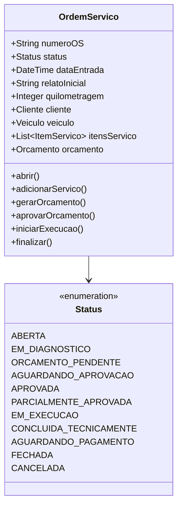
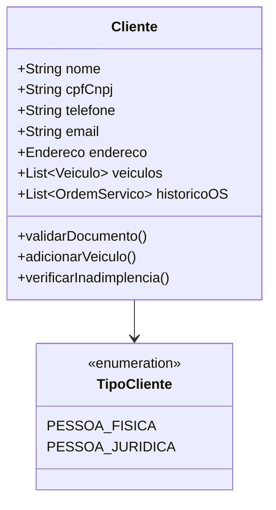
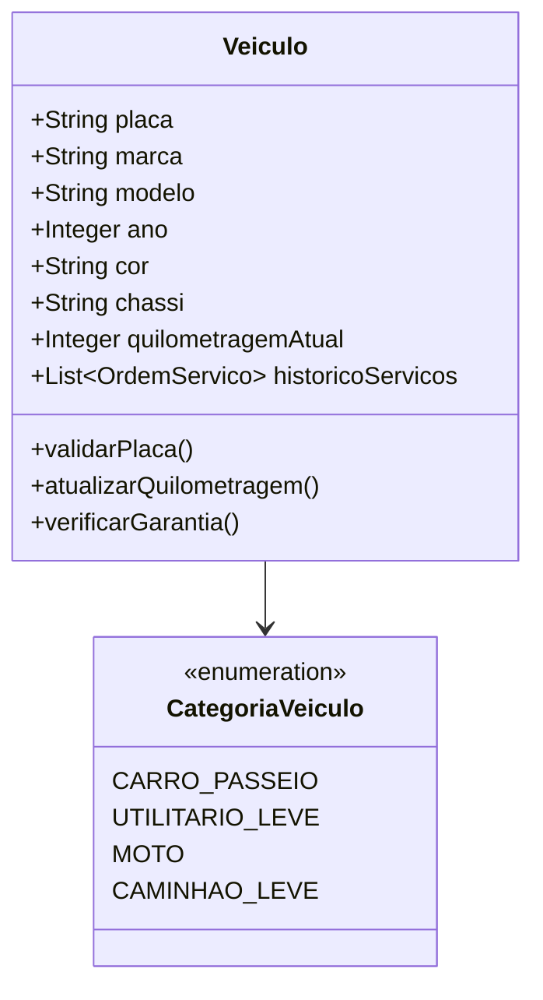
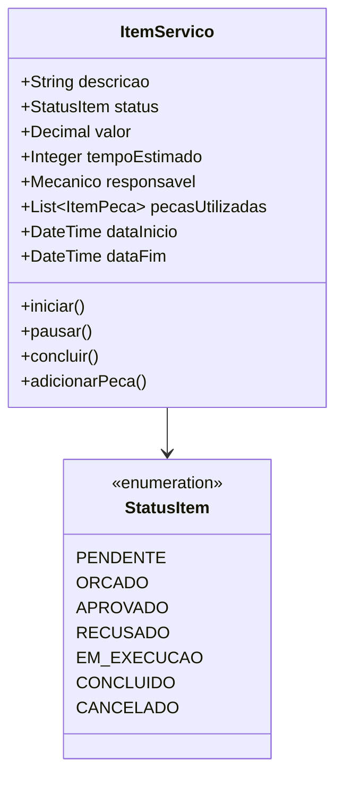
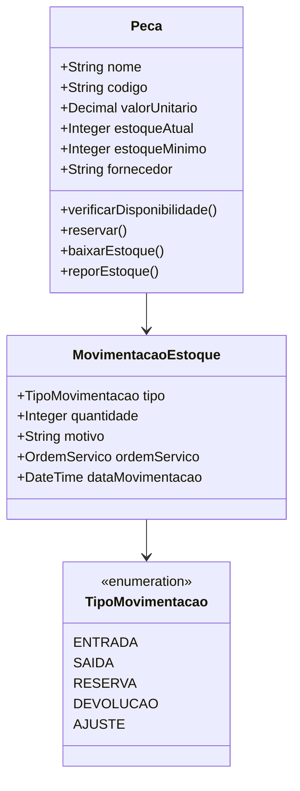
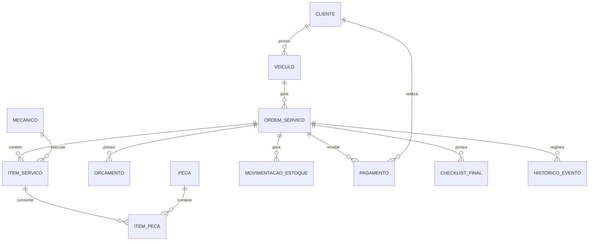
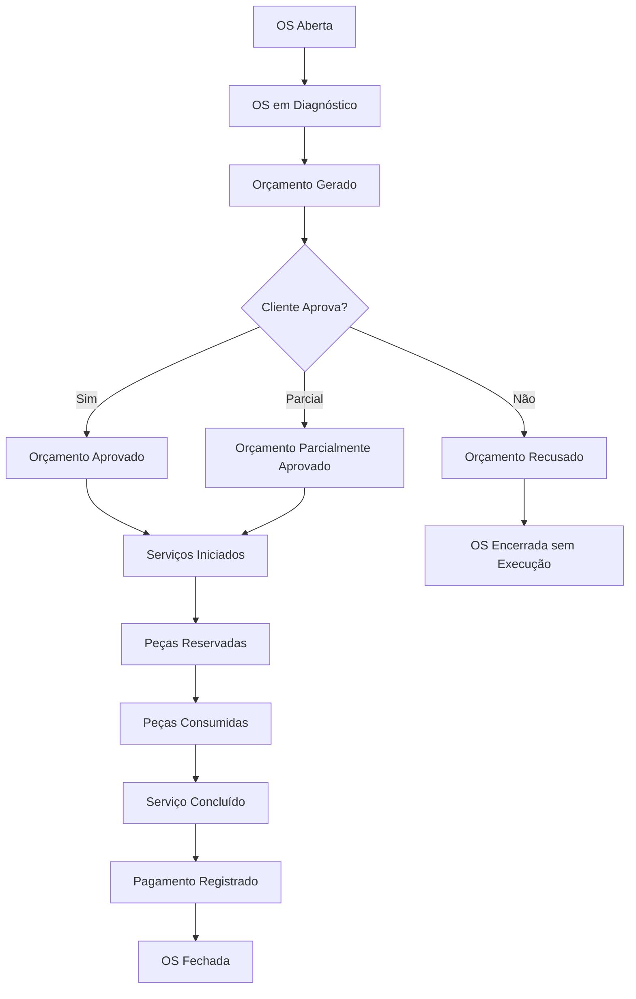

# Visão Geral do Domínio

## 🏭 Contexto de Negócio

Uma **oficina mecânica de médio porte** opera em um ambiente complexo com múltiplos atores, processos interconectados e regras de negócio específicas. O coração da operação é a **Ordem de Serviço (OS)**, que orquestra todo o fluxo desde a entrada do veículo até sua entrega.

## 👥 Atores do Domínio

### Principais Envolvidos

| Ator | Responsabilidades | Interações |
|------|-------------------|------------|
| **Cliente** | Levar veículo, relatar problemas, aprovar orçamentos, pagar | Interface principal do negócio |
| **Recepcionista** | Cadastrar clientes/veículos, abrir OS, comunicar-se | Ponte entre cliente e equipe técnica |
| **Mecânico** | Diagnosticar, executar serviços, registrar consumos | Executor técnico principal |
| **Estoquista** | Controlar peças, registrar movimentações | Garante disponibilidade de insumos |
| **Financeiro** | Controlar pagamentos, faturamento | Gestão financeira |
| **Gestor** | Aprovar exceções, analisar indicadores | Tomada de decisões estratégicas |

## 🎯 Entidades Principais do Domínio

### 1. Ordem de Serviço (OS)

**Agregado Raiz** do sistema - orquestradora de todo o processo.



### 2. Cliente

Entidade que representa o consumidor dos serviços.



### 3. Veículo

Entidade que representa os veículos atendidos pela oficina.



### 4. Item de Serviço

Representa cada serviço específico dentro de uma OS.



### 5. Peça e Estoque

Controle de peças e movimentações de estoque.



## 🔄 Relacionamentos Entre Entidades



## 🎯 Bounded Contexts

### Contexto de Atendimento

**Responsabilidade**: Gestão do processo principal de atendimento

- **Core**: Ordem de Serviço, Cliente, Veículo
- **Supporting**: Agendamento, Comunicação
- **Generic**: Notificações, Logging

### Contexto de Estoque

**Responsabilidade**: Gestão de peças e insumos

- **Core**: Peça, Movimentação de Estoque
- **Supporting**: Fornecedor, Compras
- **Generic**: Relatórios de Estoque

### Contexto Financeiro

**Responsabilidade**: Gestão financeira do negócio

- **Core**: Pagamento, Faturamento
- **Supporting**: Orçamento, Cobrança
- **Generic**: Relatórios Financeiros

## 🌊 Domain Events

### Eventos Principais



### Eventos de Domínio

| Evento | Quando Ocorre | Impacto |
|--------|---------------|---------|
| `OSCriada` | Nova OS é aberta | Inicia fluxo de atendimento |
| `DiagnosticoConcluido` | Técnico finaliza diagnóstico | Dispara geração de orçamento |
| `OrcamentoGerado` | Orçamento criado | Notifica cliente para aprovação |
| `OrcamentoAprovado` | Cliente aprova orçamento | Libera execução e reserva peças |
| `ServicoIniciado` | Serviço começa a ser executado | Registra início e aloca recursos |
| `PecaConsumida` | Peça é baixada do estoque | Atualiza controle de estoque |
| `ServicoConcluido` | Serviço é finalizado | Atualiza status da OS |
| `PagamentoRegistrado` | Pagamento é confirmado | Libera entrega do veículo |
| `OSFechada` | Processo é concluído | Gera histórico e métricas |

## 📋 Value Objects

### Documento (CPF/CNPJ)

```javascript
class Documento {
  constructor(valor) {
    if (!this.validar(valor)) {
      throw new Error('Documento inválido');
    }
    this.valor = this.limpar(valor);
    this.tipo = this.definirTipo(valor);
  }

  validar(documento) {
    const limpo = this.limpar(documento);
    return this.validarCPF(limpo) || this.validarCNPJ(limpo);
  }

  limpar(documento) {
    return documento.replace(/\D/g, '');
  }

  definirTipo(documento) {
    return this.limpar(documento).length === 11 ? 'CPF' : 'CNPJ';
  }
}
```

### Placa Veículo

```javascript
class Placa {
  constructor(valor) {
    if (!this.validar(valor)) {
      throw new Error('Placa inválida');
    }
    this.valor = this.formatar(valor);
  }

  validar(placa) {
    const mercosul = /^[A-Z]{3}\d{1}[A-Z]{1}\d{2}$/;
    const antigo = /^[A-Z]{3}\d{4}$/;
    return mercosul.test(placa) || antigo.test(placa);
  }

  formatar(placa) {
    return placa.toUpperCase().replace(/\s/g, '');
  }
}
```

### Dinheiro

```javascript
class Dinheiro {
  constructor(valor) {
    this.valor = Math.round(valor * 100); // Convertido para centavos
  }

  adicionar(outro) {
    return new Dinheiro((this.valor + outro.valor) / 100);
  }

  multiplicar(fator) {
    return new Dinheiro((this.valor * fator) / 100);
  }

  formatar() {
    return new Intl.NumberFormat('pt-BR', {
      style: 'currency',
      currency: 'BRL'
    }).format(this.valor / 100);
  }
}
```

## 🎯 Aggregates e Consistência

### Aggregate Root: OrdemServico

Garante a consistência de todas as operações relacionadas a uma OS:

```javascript
class OrdemServico {
  aprovarOrcamento(itensAprovados, usuario) {
    // Regra: Não pode aprovar itens já recusados
    itensAprovados.forEach(item => {
      if (item.status === StatusItem.RECUSADO) {
        throw new Error('Item já foi recusado anteriormente');
      }
    });

    // Atualiza status dos itens
    this.itensServico.forEach(item => {
      const aprovado = itensAprovados.find(i => i.id === item.id);
      item.status = aprovado ? StatusItem.APROVADO : StatusItem.RECUSADO;
    });

    // Define status da OS
    const itensAprovadosCount = this.itensServico
      .filter(item => item.status === StatusItem.APROVADO).length;
    
    if (itensAprovadosCount === this.itensServico.length) {
      this.status = Status.APROVADA;
    } else if (itensAprovadosCount > 0) {
      this.status = Status.PARCIALMENTE_APROVADA;
    } else {
      this.status = Status.RECUSADA;
    }

    // Domain Event
    this.addDomainEvent(new OrcamentoAprovadoEvent(
      this.id,
      itensAprovados,
      new Date(),
      usuario
    ));
  }
}
```

## 🔄 Repositories (Interfaces)

```javascript
// Interface do Repository
class OrdemServicoRepository {
  async salvar(ordemServico) {
    throw new Error('Método não implementado');
  }

  async buscarPorId(id) {
    throw new Error('Método não implementado');
  }

  async buscarPorNumeroOS(numeroOS) {
    throw new Error('Método não implementado');
  }

  async listarPorCliente(clienteId) {
    throw new Error('Método não implementado');
  }

  async listarPorStatus(status) {
    throw new Error('Método não implementado');
  }
}
```

## 📊 Métricas do Domínio

### Indicadores de Negócio

- **Tempo Médio de Atendimento**: Duração total do processo
- **Taxa de Aprovação**: Percentual de orçamentos aprovados
- **Valor Médio por OS**: Indicador financeiro
- **Rotatividade de Peças**: Movimentação de estoque
- **Satisfação do Cliente**: Feedback pós-serviço

### KPIs Operacionais

- **OS por Dia/Mês**: Volume de atendimentos
- **Ocupação dos Mecânicos**: Utilização da capacidade
- **Giro de Estoque**: Eficiência de gestão
- **Tempo de Diagnóstico**: Agilidade técnica

---

Esta visão geral do domínio estabelece as bases para a modelagem detalhada e implementação do sistema, garantindo que a solução tecnológica reflita fielmente as complexidades e necessidades do negócio de oficina mecânica.
