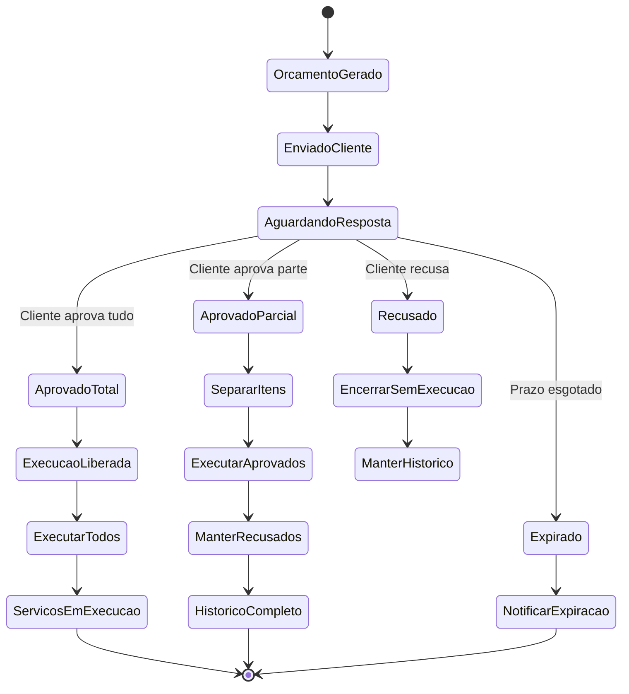

# Fluxo de Aprovação de Orçamento

## 🎯 Visão Geral

O **fluxo de aprovação** é um dos processos mais críticos da oficina mecânica, pois representa o momento em que o cliente decide sobre a execução dos serviços propostos. Este fluxo lida com múltiplos cenários, prazos e regras de negócio que precisam ser rigorosamente controlados.

## 🔄 Fluxo Principal de Aprovação



## 📋 Canais de Comunicação

### 1. E-mail (Canal Principal)

```javascript
class EmailService {
  async enviarOrcamento(ordemServico, orcamento) {
    const template = {
      assunto: `Orçamento OS ${ordemServico.numeroOS} - ${ordemServico.veiculo.placa}`,
      destinatario: ordemServico.cliente.email,
      template: 'orcamento-cliente',
      dados: {
        nomeCliente: ordemServico.cliente.nome,
        numeroOS: ordemServico.numeroOS,
        veiculo: `${ordemServico.veiculo.marca} ${ordemServico.veiculo.modelo}`,
        placa: ordemServico.veiculo.placa,
        valorTotal: orcamento.valorTotal,
        validade: orcamento.validade,
        itens: orcamento.itens,
        linkAprovacao: `https://app.oficina.com/aprovacao/${ordemServico.id}`,
        linkRecusa: `https://app.oficina.com/recusa/${ordemServico.id}`
      }
    };
    
    await this.enviar(template);
  }
}
```

### 2. WhatsApp (Comunicação Rápida)

```javascript
class WhatsAppService {
  async enviarResumoOrcamento(ordemServico, orcamento) {
    const mensagem = `
🔧 *OFICINA MECÂNICA* 🔧

Olá ${ordemServico.cliente.nome}!

Seu orçamento está pronto:
📋 OS: ${ordemServico.numeroOS}
🚗 Veículo: ${ordemServico.veiculo.marca} ${ordemServico.veiculo.modelo}
📅 Placa: ${ordemServico.veiculo.placa}

💰 *Valor Total: R$ ${orcamento.valorTotal.toFixed(2)}*
⏰ *Validade: ${orcamento.validade.toLocaleDateString('pt-BR')}*

📱 *Aprovar agora:* ${this.gerarLinkAprovacao(ordemServico.id)}
❌ *Recusar:* ${this.gerarLinkRecusa(ordemServico.id)}

Dúvidas? Ligue: (11) 9999-9999
    `;
    
    await this.enviarMensagem(ordemServico.cliente.telefone, mensagem);
  }
}
```

### 3. Portal do Cliente

```javascript
// Interface web para aprovação
const PortalAprovacao = {
  components: {
    OrcamentoDetalhe: {
      props: ['ordemServico', 'orcamento'],
      methods: {
        aprovarTodos() {
          this.$emit('aprovacao-total', {
            itensAprovados: this.orcamento.itens.map(item => item.id),
            usuario: 'portal-cliente'
          });
        },
        
        aprovarParcial() {
          const itensSelecionados = this.itensSelecionados;
          this.$emit('aprovacao-parcial', {
            itensAprovados: itensSelecionados,
            itensRecusados: this.orcamento.itens
              .filter(item => !itensSelecionados.includes(item.id))
              .map(item => item.id),
            usuario: 'portal-cliente'
          });
        },
        
        recusar(motivo) {
          this.$emit('recusa-total', {
            motivo: motivo,
            usuario: 'portal-cliente'
          });
        }
      }
    }
  }
};
```

## ⏰ Gestão de Prazos e Validade

### Configuração de Validade

```javascript
class ConfiguracaoOrcamento {
  constructor() {
    this.validadePadrao = 7; // dias
    this.validadeExcecao = {
      'servicos-rapidos': 3,
      'servicos-complexos': 10,
      'pecas-importadas': 15
    };
  }
  
  calcularValidade(ordemServico, orcamento) {
    // Verifica se há peças importadas
    const temPecasImportadas = orcamento.itens.some(item => 
      item.tipo === 'PECA' && item.importada
    );
    
    // Verifica complexidade dos serviços
    const servicosComplexos = orcamento.itens.filter(item => 
      item.tipo === 'SERVICO' && item.complexidade === 'ALTA'
    ).length;
    
    let diasValidade = this.validadePadrao;
    
    if (temPecasImportadas) {
      diasValidade = Math.max(diasValidade, this.validadeExcecao['pecas-importadas']);
    }
    
    if (servicosComplexos > 0) {
      diasValidade = Math.max(diasValidade, this.validadeExcecao['servicos-complexos']);
    }
    
    const validade = new Date();
    validade.setDate(validade.getDate() + diasValidade);
    
    return {
      data: validade,
      dias: diasValidade,
      motivo: this.definirMotivoValidade(temPecasImportadas, servicosComplexos)
    };
  }
}
```

### Sistema de Lembretes

```javascript
class LembreteService {
  async agendarLembretes(ordemServico) {
    const lembretes = [
      {
        tipo: 'LEMBRETE_24H',
        data: this.adicionarHoras(ordemServico.orcamento.validade, -24),
        mensagem: 'Seu orçamento expira em 24 horas!'
      },
      {
        tipo: 'LEMBRETE_72H',
        data: this.adicionarHoras(ordemServico.orcamento.validade, -72),
        mensagem: 'Seu orçamento expira em 3 dias!'
      },
      {
        tipo: 'EXPIRACAO',
        data: ordemServico.orcamento.validade,
        mensagem: 'Seu orçamento expirou. Contate-nos para renovar.'
      }
    ];
    
    for (const lembrete of lembretes) {
      await this.agendarNotificacao(ordemServico.id, lembrete);
    }
  }
}
```

## 🎯 Tipos de Aprovação

### 1. Aprovação Total

```javascript
class AprovacaoTotalService {
  async aprovar(ordemServicoId, dadosAprovacao) {
    const ordemServico = await this.buscarOS(ordemServicoId);
    
    // Validações
    if (ordemServico.status !== 'AGUARDANDO_APROVACAO') {
      throw new Error('OS não está aguardando aprovação');
    }
    
    if (ordemServico.orcamento.estaExpirado()) {
      throw new Error('Orçamento expirado');
    }
    
    // Atualiza todos os itens
    ordemServico.itensServico.forEach(item => {
      item.aprovar(dadosAprovacao.usuario);
    });
    
    // Atualiza status da OS
    ordemServico.status = 'APROVADA';
    ordemServico.dataAprovacao = new Date();
    ordemServico.usuarioAprovacao = dadosAprovacao.usuario;
    
    // Dispara eventos
    ordemServico.addDomainEvent(new OrcamentoAprovadoEvent(
      ordemServico.id,
      ordemServico.itensServico,
      'TOTAL',
      dadosAprovacao.usuario
    ));
    
    // Reserva peças automaticamente
    await this.estoqueService.reservarPecas(ordemServico);
    
    // Notifica equipe técnica
    await this.notificacaoService.notificarEquipeTecnica(ordemServico);
    
    await this.salvar(ordemServico);
    
    return ordemServico;
  }
}
```

### 2. Aprovação Parcial

```javascript
class AprovacaoParcialService {
  async aprovarParcial(ordemServicoId, dadosAprovacao) {
    const ordemServico = await this.buscarOS(ordemServicoId);
    
    // Separa itens aprovados e recusados
    const itensAprovados = ordemServico.itensServico.filter(item => 
      dadosAprovacao.itensAprovados.includes(item.id)
    );
    
    const itensRecusados = ordemServico.itensServico.filter(item => 
      dadosAprovacao.itensRecusados.includes(item.id)
    );
    
    // Validação: deve ter pelo menos um item aprovado
    if (itensAprovados.length === 0) {
      throw new Error('Deve aprovar pelo menos um item');
    }
    
    // Atualiza status dos itens
    itensAprovados.forEach(item => {
      item.aprovar(dadosAprovacao.usuario);
    });
    
    itensRecusados.forEach(item => {
      item.recusar(dadosAprovacao.motivoRecusa || 'Recusado pelo cliente');
    });
    
    // Recalcula valores
    const novoValorTotal = itensAprovados.reduce((total, item) => 
      total + item.valor, 0
    );
    
    // Atualiza OS
    ordemServico.status = 'PARCIALMENTE_APROVADA';
    ordemServico.valorAprovado = novoValorTotal;
    ordemServico.dataAprovacao = new Date();
    ordemServico.usuarioAprovacao = dadosAprovacao.usuario;
    
    // Dispara eventos
    ordemServico.addDomainEvent(new OrcamentoParcialmenteAprovadoEvent(
      ordemServico.id,
      itensAprovados,
      itensRecusados,
      dadosAprovacao.usuario
    ));
    
    // Reserva apenas peças dos itens aprovados
    await this.estoqueService.reservarPecasAprovadas(ordemServico, itensAprovados);
    
    await this.salvar(ordemServico);
    
    return {
      ordemServico,
      itensAprovados: itensAprovados.length,
      itensRecusados: itensRecusados.length,
      valorTotal: novoValorTotal
    };
  }
}
```

### 3. Recusa Total

```javascript
class RecusaService {
  async recusar(ordemServicoId, dadosRecusa) {
    const ordemServico = await this.buscarOS(ordemServicoId);
    
    // Atualiza todos os itens como recusados
    ordemServico.itensServico.forEach(item => {
      item.recusar(dadosRecusa.motivo);
    });
    
    // Atualiza status da OS
    ordemServico.status = 'RECUSADA';
    ordemServico.dataRecusa = new Date();
    ordemServico.motivoRecusa = dadosRecusa.motivo;
    ordemServico.usuarioRecusa = dadosRecusa.usuario;
    
    // Verifica se cobra taxa de diagnóstico
    if (ordemServico.cobraDiagnostico) {
      ordemServico.valorDiagnostico = this.getTaxaDiagnostico();
      ordemServico.status = 'AGUARDANDO_PAGAMENTO_DIAGNOSTICO';
    } else {
      ordemServico.status = 'ENCERRADA_SEM_EXECUCAO';
    }
    
    // Dispara eventos
    ordemServico.addDomainEvent(new OrcamentoRecusadoEvent(
      ordemServico.id,
      dadosRecusa.motivo,
      dadosRecusa.usuario
    ));
    
    // Libera peças reservadas (se houver)
    await this.estoqueService.liberarReservas(ordemServico.id);
    
    // Agenda follow-up
    await this.followupService.agendarContato(ordemServico.cliente.id, 7);
    
    await this.salvar(ordemServico);
    
    return ordemServico;
  }
}
```

## 🔄 Tratamento de Expiração

```javascript
class ExpiracaoService {
  async processarExpiracoes() {
    const orcamentosExpirados = await this.buscarOrcamentosExpirados();
    
    for (const ordemServico of orcamentosExpirados) {
      await this.processarExpiracao(ordemServico);
    }
  }
  
  async processarExpiracao(ordemServico) {
    // Atualiza status
    ordemServico.status = 'EXPIRADA';
    ordemServico.dataExpiracao = new Date();
    
    // Dispara evento
    ordemServico.addDomainEvent(new OrcamentoExpiradoEvent(
      ordemServico.id,
      ordemServico.orcamento.validade
    ));
    
    // Notifica cliente
    await this.notificacaoService.notificarExpiracao(ordemServico);
    
    // Notifica equipe
    await this.notificacaoService.notificarEquipeExpiracao(ordemServico);
    
    // Libera recursos
    await this.estoqueService.liberarReservas(ordemServico.id);
    
    await this.salvar(ordemServico);
  }
}
```

## 📊 Análise e Métricas

### Taxa de Conversão

```javascript
class MetricasAprovacaoService {
  async calcularTaxaConversao(periodo) {
    const orcamentos = await this.buscarOrcamentosPeriodo(periodo);
    
    const metricas = {
      total: orcamentos.length,
      aprovadosTotal: orcamentos.filter(os => os.status === 'APROVADA').length,
      aprovadosParcial: orcamentos.filter(os => os.status === 'PARCIALMENTE_APROVADA').length,
      recusados: orcamentos.filter(os => os.status === 'RECUSADA').length,
      expirados: orcamentos.filter(os => os.status === 'EXPIRADA').length
    };
    
    return {
      ...metricas,
      taxaAprovacaoTotal: (metricas.aprovadosTotal / metricas.total * 100).toFixed(2),
      taxaAprovacaoParcial: (metricas.aprovadosParcial / metricas.total * 100).toFixed(2),
      taxaRecusa: (metricas.recusados / metricas.total * 100).toFixed(2),
      taxaExpiracao: (metricas.expirados / metricas.total * 100).toFixed(2),
      taxaConversaoGeral: ((metricas.aprovadosTotal + metricas.aprovadosParcial) / metricas.total * 100).toFixed(2)
    };
  }
}
```

### Análise de Desempenho

```javascript
const relatorioAprovacao = {
  periodo: '2024-01-01 a 2024-01-31',
  metricas: {
    totalOrcamentos: 150,
    taxaConversao: '78.5%',
    tempoMedioResposta: '2.3 dias',
    canalMaisEfetivo: 'WhatsApp (65%)',
    valorMedioAprovado: 'R$ 380.00',
    motivosRecusa: [
      { motivo: 'Valor alto', percentual: '45%' },
      { motivo: 'Prazo longo', percentual: '25%' },
      { motivo: 'Fará em outro lugar', percentual: '20%' },
      { motivo: 'Sem recursos', percentual: '10%' }
    ]
  },
  recomendacoes: [
    'Revisar tabela de preços de serviços com alta recusa',
    'Oferecer opções de parcelamento para valores altos',
    'Reduzir tempo de serviços com alta taxa de expiração'
  ]
};
```

## 🎯 Melhores Práticas

### 1. Clareza na Comunicação

- ✅ Usar linguagem simples e objetiva
- ✅ Detalhar todos os itens e valores
- ✅ Incluir prazos realistas
- ✅ Oferecer canais múltiplos de contato

### 2. Experiência do Cliente

- ✅ Interface intuitiva para aprovação
- ✅ Respostas automáticas imediatas
- ✅ Acompanhamento em tempo real
- ✅ Flexibilidade na aprovação parcial

### 3. Gestão Interna

- ✅ Notificações automáticas para equipe
- ✅ Reserva imediata de peças aprovadas
- ✅ Métricas de conversão monitoradas
- ✅ Follow-up sistemático

### 4. Segurança e Auditoria

- ✅ Registro de todas as aprovações
- ✅ Rastreabilidade completa
- ✅ Validação de autenticidade
- ✅ Backup das comunicações

---

Este fluxo de aprovação garante que o processo seja transparente, eficiente e centrado no cliente, mantendo o controle rigoroso necessário para a gestão da oficina mecânica.
