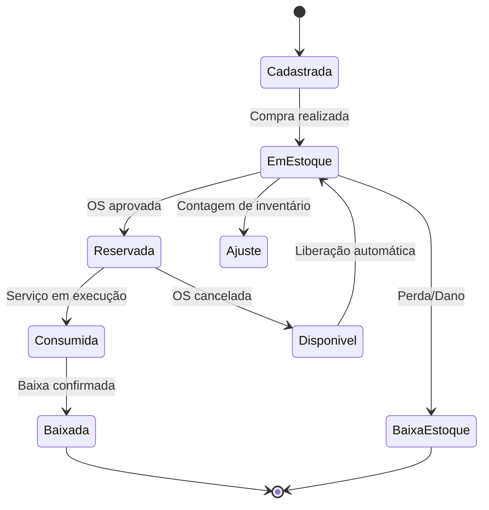

# Fluxo de Gestão de Estoque

## 🎯 Visão Geral

A **gestão de estoque** é um fluxo crítico que garante a disponibilidade de peças para execução dos serviços, controla custos e evita atrasos. Este sistema gerencia o ciclo completo das peças, desde a compra até o consumo, com rastreabilidade total.

## 🔄 Ciclo de Vida das Peças



## 📦 Estrutura do Sistema de Estoque

### 1. Cadastro de Peças

```javascript
class Peca {
  constructor(dados) {
    this.id = dados.id;
    this.codigo = dados.codigo; // Código único
    this.nome = dados.nome;
    this.descricao = dados.descricao;
    this.categoria = dados.categoria;
    this.fornecedor = dados.fornecedor;
    this.valorUnitario = dados.valorUnitario;
    this.unidadeMedida = dados.unidadeMedida; // UN, KG, MT, etc.
    this.tempoReposicao = dados.tempoReposicao; // dias
    this.estoqueMinimo = dados.estoqueMinimo;
    this.estoqueMaximo = dados.estoqueMaximo;
    this.perecivel = dados.perecivel || false;
    this.dataValidade = dados.dataValidade;
    this.localizacao = dados.localizacao; // Corredor/Prateleira
    this.ativo = true;
  }
  
  validar() {
    const erros = [];
    
    if (!this.codigo) erros.push('Código é obrigatório');
    if (!this.nome) erros.push('Nome é obrigatório');
    if (this.valorUnitario <= 0) erros.push('Valor unitário deve ser positivo');
    if (this.estoqueMinimo >= this.estoqueMaximo) {
      erros.push('Estoque mínimo deve ser menor que máximo');
    }
    
    if (erros.length > 0) {
      throw new Error(`Validação falhou: ${erros.join(', ')}`);
    }
  }
  
  estaEmFalta() {
    return this.quantidadeAtual <= 0;
  }
  
  estaAbaixoMinimo() {
    return this.quantidadeAtual <= this.estoqueMinimo;
  }
  
  precisaReposicao() {
    return this.estaAbaixoMinimo() && !this.perecivel;
  }
}
```

### 2. Controle de Quantidade

```javascript
class ControleEstoque {
  constructor(peca) {
    this.peca = peca;
    this.quantidadeAtual = 0;
    this.quantidadeReservada = 0;
    this.quantidadeDisponivel = 0;
    this.ultimoMovimento = null;
  }
  
  get quantidadeDisponivel() {
    return this.quantidadeAtual - this.quantidadeReservada;
  }
  
  async reservar(quantidade, ordemServicoId, motivo) {
    if (quantidade > this.quantidadeDisponivel) {
      throw new Error(`Quantidade insuficiente. Disponível: ${this.quantidadeDisponivel}`);
    }
    
    this.quantidadeReservada += quantidade;
    
    await this.registrarMovimentacao({
      tipo: 'RESERVA',
      quantidade: quantidade,
      ordemServicoId: ordemServicoId,
      motivo: motivo,
      usuario: 'sistema'
    });
    
    // Verifica se precisa repor
    if (this.peca.estaAbaixoMinimo()) {
      await this.dispararAlertaReposicao();
    }
  }
  
  async consumir(quantidade, ordemServicoId, motivo) {
    if (quantidade > this.quantidadeReservada) {
      throw new Error('Quantidade maior que a reservada');
    }
    
    this.quantidadeAtual -= quantidade;
    this.quantidadeReservada -= quantidade;
    
    await this.registrarMovimentacao({
      tipo: 'SAIDA',
      quantidade: quantidade,
      ordemServicoId: ordemServicoId,
      motivo: motivo,
      usuario: 'mecanico'
    });
    
    // Libera reserva se houver
    if (this.quantidadeReservada < 0) {
      this.quantidadeReservada = 0;
    }
  }
  
  async repor(quantidade, fornecedorId, motivo) {
    this.quantidadeAtual += quantidade;
    
    await this.registrarMovimentacao({
      tipo: 'ENTRADA',
      quantidade: quantidade,
      fornecedorId: fornecedorId,
      motivo: motivo,
      usuario: 'estoquista'
    });
  }
}
```

## 🔄 Fluxo de Reserva e Consumo

### 1. Reserva Automática

```javascript
class ReservaAutomaticaService {
  async reservarPecas(ordemServico) {
    const itensAprovados = ordemServico.itensServico.filter(item => 
      item.status === 'APROVADO'
    );
    
    for (const item of itensAprovados) {
      for (const pecaItem of item.pecas) {
        try {
          await this.estoqueService.reservar(
            pecaItem.pecaId,
            pecaItem.quantidade,
            ordemServico.id,
            `Reserva automática - OS ${ordemServico.numeroOS}`
          );
          
          // Atualiza status do item
          item.pecasReservadas = true;
          
        } catch (error) {
          // Peça não disponível
          await this.tratarFaltaPeca(item, pecaItem, error.message);
        }
      }
    }
    
    // Verifica se todas as peças foram reservadas
    const todasReservadas = itensAprovados.every(item => item.pecasReservadas);
    
    if (!todasReservadas) {
      ordemServico.status = 'AGUARDANDO_PECA';
      await this.notificarFaltaPecas(ordemServico);
    } else {
      ordemServico.status = 'PRONTO_EXECUCAO';
      await this.notificarEquipeTecnica(ordemServico);
    }
    
    await this.ordemServicoRepository.salvar(ordemServico);
  }
  
  async tratarFaltaPeca(itemServico, pecaItem, motivo) {
    // Marca peça como não disponível
    pecaItem.disponivel = false;
    pecaItem.motivoIndisponibilidade = motivo;
    
    // Verifica fornecedores alternativos
    const fornecedores = await this.fornecedorService.buscarFornecedoresPeca(pecaItem.pecaId);
    
    if (fornecedores.length > 0) {
      await this.solicitarCotacao(pecaItem, fornecedores);
    } else {
      await this.notificarGerente(pecaItem, motivo);
    }
  }
}
```

### 2. Consumo During Execução

```javascript
class ConsumoService {
  async consumirPeca(ordemServicoId, pecaId, quantidade, mecanicoId) {
    const ordemServico = await this.buscarOS(ordemServicoId);
    const peca = await this.buscarPeca(pecaId);
    
    // Validações
    if (ordemServico.status !== 'EM_EXECUCAO') {
      throw new Error('OS não está em execução');
    }
    
    if (!peca.estaReservada(ordemServicoId)) {
      throw new Error('Peça não está reservada para esta OS');
    }
    
    // Realiza consumo
    await this.estoqueService.consumir(
      pecaId,
      quantidade,
      ordemServicoId,
      `Consumo - OS ${ordemServico.numeroOS} - Mecânico: ${mecanicoId}`
    );
    
    // Atualiza item de serviço
    const itemServico = ordemServico.itensServico.find(item => 
      item.pecas.some(p => p.pecaId === pecaId)
    );
    
    if (itemServico) {
      const pecaItem = itemServico.pecas.find(p => p.pecaId === pecaId);
      pecaItem.quantidadeConsumida += quantidade;
      pecaItem.dataConsumo = new Date();
      pecaItem.mecanicoConsumo = mecanicoId;
    }
    
    // Dispara evento
    ordemServico.addDomainEvent(new PecaConsumidaEvent(
      ordemServicoId,
      pecaId,
      quantidade,
      mecanicoId
    ));
    
    await this.salvar(ordemServico);
    
    return {
      sucesso: true,
      peca: peca.nome,
      quantidade: quantidade,
      saldo: peca.quantidadeAtual
    };
  }
}
```

## 📊 Gestão de Compras

### 1. Sistema de Compras Automáticas

```javascript
class CompraAutomaticaService {
  async processarReposicoes() {
    // Busca peças que precisam de reposição
    const pecasParaRepor = await this.estoqueRepository.buscarPecasAbaixoMinimo();
    
    for (const peca of pecasParaRepor) {
      await this.gerarOrdemCompra(peca);
    }
  }
  
  async gerarOrdemCompra(peca) {
    const quantidadeSugerida = this.calcularQuantidadeCompra(peca);
    const fornecedores = await this.buscarMelhoresFornecedores(peca);
    
    const ordemCompra = {
      pecaId: peca.id,
      quantidade: quantidadeSugerida,
      fornecedores: fornecedores,
      prioridade: this.definirPrioridade(peca),
      dataNecessidade: this.calcularDataNecessidade(peca),
      valorEstimado: quantidadeSugerida * peca.valorUnitario
    };
    
    // Cria ordem de compra
    await this.ordemCompraRepository.criar(ordemCompra);
    
    // Notifica compras
    await this.notificarDepartamentoCompras(ordemCompra);
    
    // Agenda acompanhamento
    await this.agendarAcompanhamento(ordemCompra);
  }
  
  calcularQuantidadeCompra(peca) {
    // Baseado no histórico de consumo
    const consumoMedioMensal = this.getConsumoMedioMensal(peca.id);
    const tempoReposicao = peca.tempoReposicao;
    const estoqueSeguranca = peca.estoqueMinimo;
    
    // Fórmula: (Consumo médio × Tempo de reposição) + Estoque de segurança - Estoque atual
    const quantidadeIdeal = (consumoMedioMensal * tempoReposicao / 30) + estoqueSeguranca;
    const quantidadeComprar = Math.max(0, quantidadeIdeal - peca.quantidadeAtual);
    
    return Math.ceil(quantidadeComprar);
  }
}
```

### 2. Cotação com Fornecedores

```javascript
class CotacaoService {
  async solicitarCotacoes(pecaId, quantidade) {
    const fornecedores = await this.fornecedorRepository.buscarPorPeca(pecaId);
    const cotacoes = [];
    
    for (const fornecedor of fornecedores) {
      const cotacao = await this.solicitarCotacaoFornecedor(fornecedor, pecaId, quantidade);
      cotacoes.push(cotacao);
    }
    
    // Ordena pelo melhor preço
    cotacoes.sort((a, b) => a.valorUnitario - b.valorUnitario);
    
    return cotacoes;
  }
  
  async solicitarCotacaoFornecedor(fornecedor, pecaId, quantidade) {
    const solicitacao = {
      fornecedorId: fornecedor.id,
      pecaId: pecaId,
      quantidade: quantidade,
      dataSolicitacao: new Date(),
      prazoResposta: new Date(Date.now() + 48 * 60 * 60 * 1000), // 48 horas
      status: 'AGUARDANDO'
    };
    
    // Envia por email/API
    await this.enviarSolicitacao(fornecedor, solicitacao);
    
    return await this.cotacaoRepository.criar(solicitacao);
  }
}
```

## 📋 Inventário e Auditoria

### 1. Contagem de Inventário

```javascript
class InventarioService {
  async iniciarContagem(tipo = 'PARCIAL') {
    const inventario = {
      id: this.gerarId(),
      tipo: tipo, // PARCIAL, TOTAL, ROTATIVO
      status: 'EM_ANDAMENTO',
      dataInicio: new Date(),
      dataPrevistaFim: this.calcularDataPrevista(tipo),
      responsaveis: [],
      itens: []
    };
    
    if (tipo === 'TOTAL') {
      // Inclui todas as peças
      const todasPecas = await this.pecaRepository.buscarTodas();
      inventario.itens = todasPecas.map(peca => ({
        pecaId: peca.id,
        quantidadeSistema: peca.quantidadeAtual,
        quantidadeContada: null,
        divergencia: null,
        status: 'PENDENTE'
      }));
    } else if (tipo === 'ROTATIVO') {
      // Apenas peças selecionadas (ABC analysis)
      const pecasSelecionadas = await this.selecionarPecasRotativo();
      inventario.itens = pecasSelecionadas.map(peca => ({
        pecaId: peca.id,
        quantidadeSistema: peca.quantidadeAtual,
        quantidadeContada: null,
        divergencia: null,
        status: 'PENDENTE'
      }));
    }
    
    return await this.inventarioRepository.criar(inventario);
  }
  
  async registrarContagem(inventarioId, pecaId, quantidadeContada, usuarioId) {
    const inventario = await this.buscarInventario(inventarioId);
    const item = inventario.itens.find(i => i.pecaId === pecaId);
    
    if (!item) {
      throw new Error('Item não encontrado no inventário');
    }
    
    item.quantidadeContada = quantidadeContada;
    item.divergencia = quantidadeContada - item.quantidadeSistema;
    item.status = 'CONTADO';
    item.dataContagem = new Date();
    item.usuarioContagem = usuarioId;
    
    // Se houver divergência, cria ajuste pendente
    if (item.divergencia !== 0) {
      await this.criarAjustePendente(inventarioId, pecaId, item.divergencia);
    }
    
    await this.inventarioRepository.atualizar(inventario);
    
    // Verifica se inventário está completo
    const todosContados = inventario.itens.every(i => i.status === 'CONTADO');
    if (todosContados) {
      await this.finalizarInventario(inventarioId);
    }
  }
}
```

### 2. Ajustes de Estoque

```javascript
class AjusteEstoqueService {
  async criarAjuste(pecaId, quantidade, tipo, motivo, usuarioId) {
    const peca = await this.buscarPeca(pecaId);
    
    const ajuste = {
      id: this.gerarId(),
      pecaId: pecaId,
      quantidade: quantidade,
      tipo: tipo, // ENTRADA, SAIDA, AJUSTE
      motivo: motivo,
      usuarioId: usuarioId,
      data: new Date(),
      status: 'PENDENTE',
      aprovacoes: []
    };
    
    // Se for ajuste significativo, requer aprovação
    if (Math.abs(quantidade) > this.limiteAprovacao) {
      ajuste.status = 'AGUARDANDO_APROVACAO';
      await this.solicitarAprovacoes(ajuste);
    } else {
      await this.aplicarAjuste(ajuste);
    }
    
    return await this.ajusteRepository.criar(ajuste);
  }
  
  async aplicarAjuste(ajuste) {
    const peca = await this.buscarPeca(ajuste.pecaId);
    
    if (ajuste.tipo === 'ENTRADA') {
      peca.quantidadeAtual += ajuste.quantidade;
    } else if (ajuste.tipo === 'SAIDA') {
      peca.quantidadeAtual = Math.max(0, peca.quantidadeAtual - Math.abs(ajuste.quantidade));
    } else if (ajuste.tipo === 'AJUSTE') {
      peca.quantidadeAtual += ajuste.quantidade;
    }
    
    // Registra movimentação
    await this.movimentacaoService.registrar({
      pecaId: ajuste.pecaId,
      tipo: 'AJUSTE',
      quantidade: ajuste.quantidade,
      motivo: ajuste.motivo,
      usuarioId: ajuste.usuarioId,
      ajusteId: ajuste.id
    });
    
    ajuste.status = 'APLICADO';
    ajuste.dataAplicacao = new Date();
    
    await this.pecaRepository.salvar(peca);
    await this.ajusteRepository.atualizar(ajuste);
  }
}
```

## 📊 Relatórios e Análises

### 1. Relatório de Movimentação

```javascript
class RelatorioEstoqueService {
  async gerarRelatorioMovimentacao(periodo) {
    const movimentacoes = await this.movimentacaoRepository.buscarPorPeriodo(periodo);
    
    const analise = {
      periodo: periodo,
      totalEntradas: 0,
      totalSaidas: 0,
      valorTotalEntradas: 0,
      valorTotalSaidas: 0,
      pecasMaisMovimentadas: [],
      pecasMenosMovimentadas: [],
      fornecedores: [],
      evolucaoEstoque: []
    };
    
    // Agrupa por peça
    const porPeca = {};
    movimentacoes.forEach(mov => {
      if (!porPeca[mov.pecaId]) {
        porPeca[mov.pecaId] = {
          entradas: 0,
          saidas: 0,
          valor: 0
        };
      }
      
      if (mov.tipo === 'ENTRADA') {
        porPeca[mov.pecaId].entradas += mov.quantidade;
        analise.totalEntradas += mov.quantidade;
        analise.valorTotalEntradas += mov.quantidade * mov.valorUnitario;
      } else if (mov.tipo === 'SAIDA') {
        porPeca[mov.pecaId].saidas += mov.quantidade;
        analise.totalSaidas += mov.quantidade;
        analise.valorTotalSaidas += mov.quantidade * mov.valorUnitario;
      }
    });
    
    // Calcula peças mais movimentadas
    analise.pecasMaisMovimentadas = Object.entries(porPeca)
      .map(([pecaId, dados]) => ({
        pecaId,
        totalMovimentado: dados.entradas + dados.saidas,
        ...dados
      }))
      .sort((a, b) => b.totalMovimentado - a.totalMovimentado)
      .slice(0, 10);
    
    return analise;
  }
}
```

### 2. Análise de Giro de Estoque

```javascript
class GiroEstoqueService {
  async calcularGiroEstoque(periodo = 12) { // meses
    const pecas = await this.pecaRepository.buscarTodas();
    const resultado = [];
    
    for (const peca of pecas) {
      const consumoMedioMensal = await this.getConsumoMedioMensal(peca.id, periodo);
      const estoqueMedio = await this.getEstoqueMedio(peca.id, periodo);
      const valorMedioEstoque = estoqueMedio * peca.valorUnitario;
      const custoVendasMensal = consumoMedioMensal * peca.valorUnitario;
      
      const giro = valorMedioEstoque > 0 ? custoVendasMensal / valorMedioEstoque : 0;
      const diasEstoque = giro > 0 ? 30 / giro : 0;
      
      resultado.push({
        pecaId: peca.id,
        nome: peca.nome,
        consumoMedioMensal,
        estoqueMedio,
        giroMensal: giro,
        diasEstoque,
        classificacao: this.classificarGiro(giro)
      });
    }
    
    return resultado.sort((a, b) => b.giroMensal - a.giroMensal);
  }
  
  classificarGiro(giro) {
    if (giro >= 12) return 'A'; // Gira mais de 1x por mês
    if (giro >= 4) return 'B';  // Gira a cada 1-3 meses
    return 'C'; // Gira menos de 1x a cada 3 meses
  }
}
```

## 🚨 Alertas e Notificações

### 1. Sistema de Alertas

```javascript
class AlertaEstoqueService {
  async verificarAlertas() {
    const alertas = [];
    
    // Estoque baixo
    const pecasEstoqueBaixo = await this.estoqueRepository.buscarEstoqueBaixo();
    for (const peca of pecasEstoqueBaixo) {
      alertas.push({
        tipo: 'ESTOQUE_BAIXO',
        pecaId: peca.id,
        mensagem: `Peça ${peca.nome} com estoque baixo: ${peca.quantidadeAtual} unidades`,
        prioridade: 'ALTA',
        acoes: ['Gerar ordem de compra', 'Notificar gerente']
      });
    }
    
    // Peças sem movimento
    const pecasParadas = await this.buscarPecasParadas(90); // 90 dias
    for (const peca of pecasParadas) {
      alertas.push({
        tipo: 'PECA_PARADA',
        pecaId: peca.id,
        mensagem: `Peça ${peca.nome} sem movimento há 90 dias`,
        prioridade: 'MEDIA',
        acoes: ['Analisar necessidade', 'Considerar promoção']
      });
    }
    
    // Peças vencendo
    const pecasVencendo = await this.buscarPecasVencendo(30); // 30 dias
    for (const peca of pecasVencendo) {
      alertas.push({
        tipo: 'VALIDADE_PROXIMA',
        pecaId: peca.id,
        mensagem: `Peça ${peca.nome} vence em ${peca.diasParaVencer} dias`,
        prioridade: 'ALTA',
        acoes: ['Usar em serviços', 'Devolver ao fornecedor']
      });
    }
    
    await this.processarAlertas(alertas);
  }
}
```

---

Este sistema de gestão de estoque garante o controle completo das peças, desde a compra até o consumo, com rastreabilidade, automação e inteligência para otimizar os processos da oficina mecânica.
