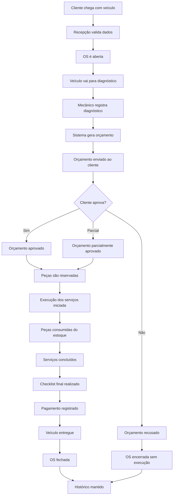
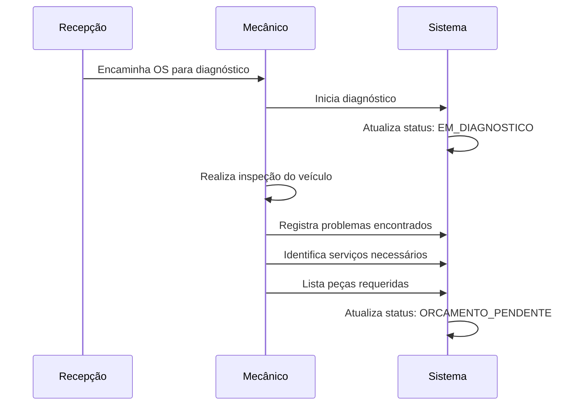
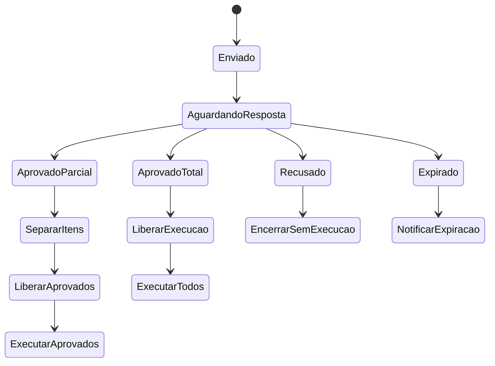
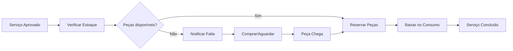
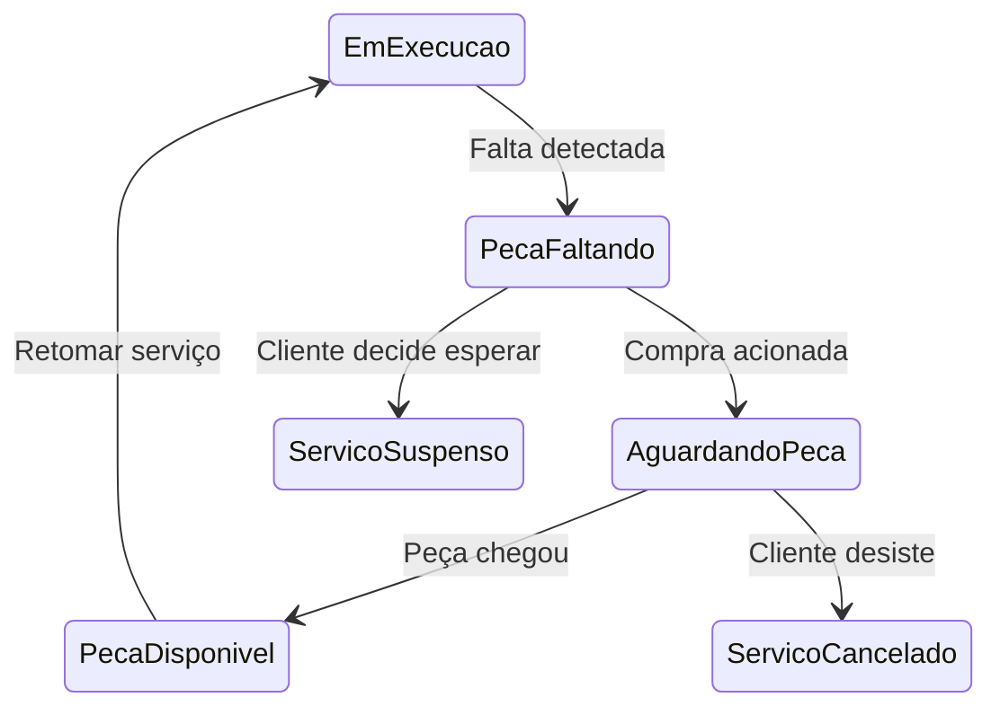
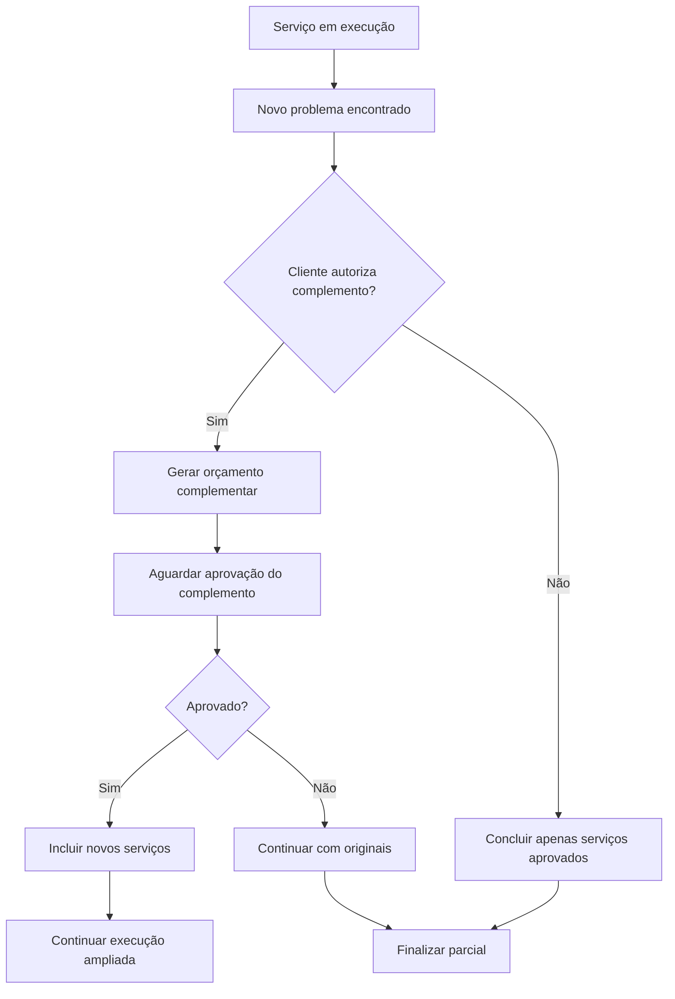

# Fluxo de Ordem de Serviço

## 🎯 Visão Geral

A **Ordem de Serviço (OS)** é o coração do sistema da oficina mecânica, orquestrando todo o processo desde a entrada do veículo até sua entrega. Este fluxo documenta todas as etapas, regras de negócio e exceções relacionadas à gestão de OS.

## 🔄 Fluxo Principal (Happy Path)



## 📋 Etapas Detalhadas

### 1. Abertura da OS

#### Pré-condições
- ✅ Cliente cadastrado no sistema
- ✅ Veículo cadastrado e vinculado ao cliente
- ✅ Dados básicos validados (CPF/CNPJ, placa)

#### Passos

1. **Recepção do Cliente**
   ```javascript
   // Dados coletados na abertura
   const dadosAbertura = {
     clienteId: 123,
     veiculoId: 456,
     relatoInicial: "Barulho ao frear e carro puxando para direita",
     quilometragem: 52340,
     dataEntrada: new Date(),
     atendente: "João da Recepção"
   };
   ```

2. **Criação da OS**
   ```javascript
   const ordemServico = new OrdemServico({
     clienteId: dadosAbertura.clienteId,
     veiculoId: dadosAbertura.veiculoId,
     relatoInicial: dadosAbertura.relatoInicial,
     quilometragem: dadosAbertura.quilometragem
   });
   
   ordemServico.abrir(); // Status: ABERTA
   ```

3. **Validações Obrigatórias**
   - CPF/CNPJ válido e único
   - Placa válida e não duplicada
   - Cliente ativo (sem pendências financeiras)
   - Veículo vinculado corretamente ao cliente

#### Regras de Negócio
- 📋 Número da OS gerado automaticamente (formato: AAAA-NNNN)
- 📋 Data e hora de entrada registradas automaticamente
- 📋 Status inicial: **ABERTA**
- 📋 Histórico de eventos iniciado

### 2. Diagnóstico

#### Responsável: Mecânico/Técnico



#### Processo de Diagnóstico

1. **Inspeção Visual e Funcional**
   - Estado geral do veículo
   - Sintomas relatados pelo cliente
   - Testes específicos quando necessário

2. **Identificação de Problemas**
   ```javascript
   const diagnosticos = [
     {
       descricao: "Pastilhas de freio dianteiras gastas",
       gravidade: "ALTA",
       servicosSugeridos: ["Troca de pastilhas dianteiras"],
       pecasNecessarias: [
         { codigo: "PAST-FRE-DIANT", quantidade: 1 }
       ]
     },
     {
       descricao: "Alinhamento da direção desajustado",
       gravidade: "MEDIA",
       servicosSugeridos: ["Alinhamento de direção"],
       pecasNecessarias: []
     }
   ];
   ```

3. **Registro no Sistema**
   - Descrição técnica dos problemas
   - Serviços recomendados
   - Peças necessárias com quantidades
   - Tempo estimado para cada serviço
   - Observações importantes

#### Regras de Negócio
- 📋 Diagnóstico deve ser detalhado e claro
- 📋 Tempo estimado deve ser realista
- 📋 Peças devem estar cadastradas no sistema
- 📋 Mecânico responsável deve ser registrado

### 3. Geração do Orçamento

#### Cálculo Automático

```javascript
class GeradorOrcamento {
  gerar(ordemServico, diagnosticos) {
    const itens = [];
    let valorTotal = 0;
    
    diagnosticos.forEach(diagnostico => {
      diagnostico.servicosSugeridos.forEach(servico => {
        const valorServico = this.calcularValorServico(servico);
        itens.push({
          tipo: 'SERVICO',
          descricao: servico,
          valor: valorServico,
          tempoEstimado: this.getTempoEstimado(servico)
        });
        valorTotal += valorServico;
      });
      
      diagnostico.pecasNecessarias.forEach(peca => {
        const valorPeca = this.getValorPeca(peca.codigo);
        itens.push({
          tipo: 'PECA',
          codigo: peca.codigo,
          descricao: peca.descricao,
          quantidade: peca.quantidade,
          valorUnitario: valorPeca,
          valorTotal: valorPeca * peca.quantidade
        });
        valorTotal += valorPeca * peca.quantidade;
      });
    });
    
    return new Orcamento({
      itens,
      valorTotal,
      validade: this.calcularValidade(),
      dataGeracao: new Date()
    });
  }
}
```

#### Estrutura do Orçamento

| Item | Tipo | Descrição | Quantidade | Valor Unit. | Valor Total |
|------|------|-----------|------------|-------------|------------|
| 1 | Serviço | Troca de pastilhas dianteiras | 1 | R$ 180,00 | R$ 180,00 |
| 2 | Peça | Kit pastilhas freio dianteiro | 1 | R$ 240,00 | R$ 240,00 |
| 3 | Serviço | Alinhamento de direção | 1 | R$ 120,00 | R$ 120,00 |
| **Total** | | | | | **R$ 540,00** |

#### Regras de Negócio
- 📋 Validade padrão: 7 dias corridos
- 📋 Valores baseados em tabela predefinida
- 📋 Peças com preço atualizado do estoque
- 📋 Mão de obra calculada por tempo estimado

### 4. Aprovação do Orçamento

#### Canais de Comunicação
- 📧 E-mail com PDF do orçamento
- 📱 WhatsApp com resumo e link para aprovação
- 📞 Telefone (seguido por confirmação escrita)
- 🏠 Presencial na oficina

#### Fluxo de Aprovação



#### Tipos de Resposta

1. **Aprovação Total**
   - Todos os itens aprovados
   - Status da OS: **APROVADA**
   - Todos os serviços liberados para execução

2. **Aprovação Parcial**
   - Apenas alguns itens aprovados
   - Status da OS: **PARCIALMENTE_APROVADA**
   - Itens recusados mantidos no histórico

3. **Recusa Total**
   - Nenhum item aprovado
   - Status da OS: **RECUSADA**
   - OS encerrada sem execução

4. **Expiração**
   - Sem resposta no prazo de validade
   - Status da OS: **EXPIRADA**
   - Novo orçamento necessário

### 5. Execução dos Serviços

#### Pré-condições
- ✅ Orçamento aprovado (total ou parcial)
- ✅ Peças disponíveis em estoque
- ✅ Mecânico disponível

#### Processo de Execução

```javascript
class ExecutorServico {
  async executar(ordemServico, itensAprovados) {
    for (const item of itensAprovados) {
      // 1. Reservar peças necessárias
      await this.reservarPecas(item.pecas);
      
      // 2. Iniciar serviço
      item.iniciar(new Date(), mecanicoResponsavel);
      
      // 3. Consumir peças durante execução
      for (const peca of item.pecas) {
        await this.estoque.baixar(peca.codigo, peca.quantidade, ordemServico.id);
      }
      
      // 4. Concluir serviço
      item.concluir(new Date(), observacoesTecnicas);
    }
  }
}
```

#### Controle de Estoque



#### Regras de Negócio
- 📋 Nenhum serviço pode iniciar sem peças disponíveis
- 📋 Consumo de peças deve ser registrado em tempo real
- 📋 Estoque mínimo deve ser verificado após cada baixa
- 📋 Mecânico deve registrar início e fim de cada serviço

### 6. Finalização e Entrega

#### Checklist Final Obrigatório

```javascript
const checklistFinal = {
  servicosExecutados: true,
  pecasInstaladas: true,
  semPendenciasTecnicas: true,
  testeRealizado: true,
  veiculoLimpo: true,
  documentosOk: true,
  pagamentoRegistrado: false,
  clienteNotificado: false
};
```

#### Processo de Finalização

1. **Verificação Técnica**
   - Todos os serviços aprovados executados
   - Peças instaladas corretamente
   - Teste funcional realizado

2. **Limpeza e Preparação**
   - Limpeza básica do veículo
   - Remoção de ferramentas e resíduos
   - Verificação de itens pessoais

3. **Registro Financeiro**
   - Cálculo do valor final
   - Registro do pagamento
   - Emissão de recibo/fatura

4. **Comunicação com Cliente**
   - Notificação de conclusão
   - Agendamento da retirada
   - Entrega de documentos

## 🚨 Fluxos de Exceção

### Falta de Peças



#### Tratamento
- ⏸️ Serviço pausado automaticamente
- 📧 Cliente notificado sobre atraso
- 🛒 Compras acionada automaticamente
- 📅 Novo prazo estimado calculado

### Cancelamento pelo Cliente

#### Regras por Estágio

| Estágio da OS | Condições | Taxas Aplicáveis |
|---------------|-----------|------------------|
| **Antes do orçamento** | Sem custos | Grátis |
| **Após orçamento, antes da execução** | Taxa de diagnóstico | R$ 50,00 |
| **Durante execução** | Custos proporcionais | Serviços já realizados + peças |
| **Veículo desmontado** | Taxa de remontagem | Variável |

### Novos Problemas Descobertos



## 📊 Métricas e KPIs

### Indicadores de Processo

```javascript
const metricasOS = {
  tempoMedioAtendimento: "4.5 dias",
  taxaAprovacao: "78%",
  valorMedioOS: "R$ 450,00",
  satisfacaoCliente: "4.2/5.0",
  retrabalho: "3%"
};
```

### Relatórios Importantes

1. **Relatório Diário**
   - OS abertas no dia
   - OS concluídas no dia
   - Faturamento do dia

2. **Relatório Semanal**
   - Tempo médio por tipo de serviço
   - Peças mais consumidas
   - Mecânicos mais produtivos

3. **Relatório Mensal**
   - Evolução do faturamento
   - Taxa de aprovação por período
   - Análise de sazonalidade

## 🔧 Integrações Sistêmicas

### Eventos Disparados

```javascript
// Eventos gerados durante o fluxo
const eventos = [
  'OSCriada',
  'DiagnosticoConcluido',
  'OrcamentoGerado',
  'OrcamentoAprovado',
  'ServicoIniciado',
  'PecaConsumida',
  'ServicoConcluido',
  'PagamentoRegistrado',
  'OSFechada'
];
```

### Integrações Externas

- 📧 **Email Service**: Notificações automáticas
- 📱 **WhatsApp API**: Comunicação rápida
- 💳 **Payment Gateway**: Processamento de pagamentos
- 📊 **Analytics**: Métricas e relatórios
- 🏪 **Supplier API**: Cotação de peças

---

Este fluxo de Ordem de Serviço estabelece as bases para a implementação do sistema, garantindo que todas as regras de negócio sejam respeitadas e que o processo seja eficiente e rastreável.
