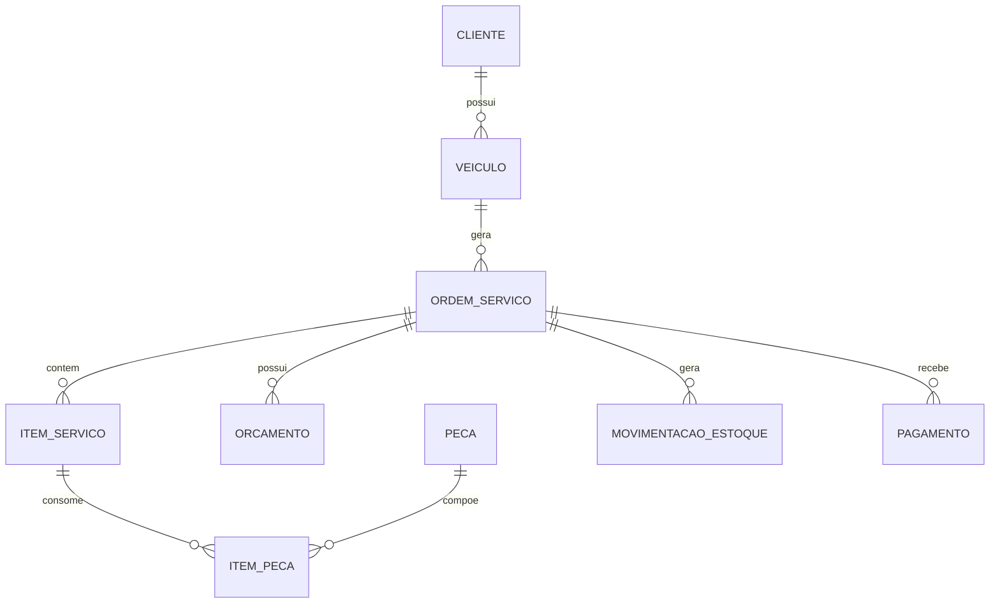
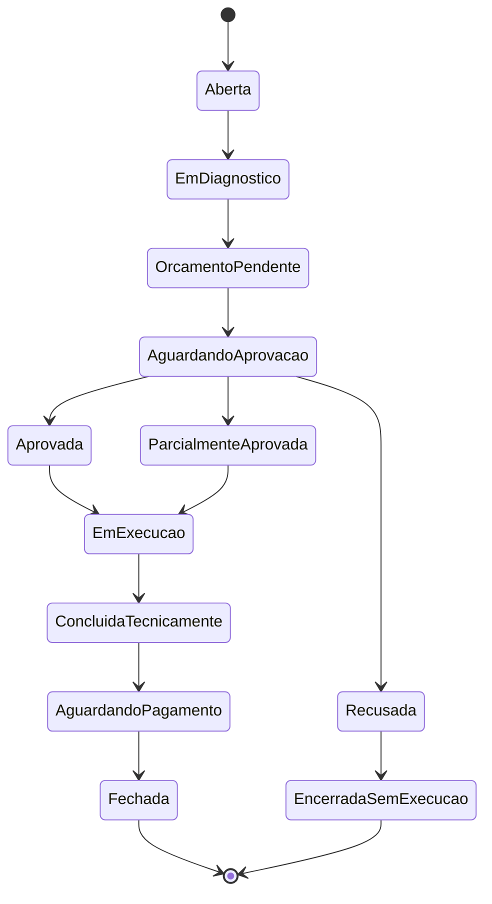
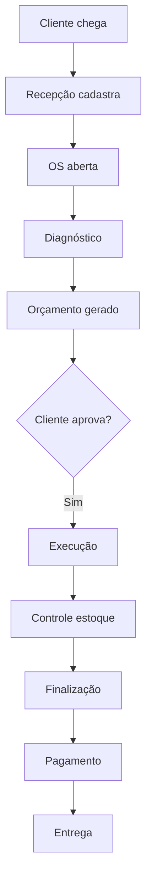

# Proposta de Solução

## 🎯 Visão Geral da Proposta

Propomos o desenvolvimento de um **Sistema Integrado de Gestão de Oficina Mecânica** utilizando **Domain-Driven Design (DDD)** como abordagem principal para garantir que a solução reflita fielmente as complexidades do negócio.

## 🏗️ Abordagem Arquitetural

### Monolito com Arquitetura em Camadas

Para o MVP, adotaremos uma arquitetura monolítica bem estruturada:

```
┌─────────────────────────────────────┐
│           API Layer                 │
│  (Controllers, Endpoints REST)      │
├─────────────────────────────────────┤
│         Application Layer           │
│   (Use Cases, Application Services) │
├─────────────────────────────────────┤
│          Domain Layer               │
│  (Entities, Value Objects, Aggregates) │
├─────────────────────────────────────┤
│       Infrastructure Layer          │
│   (Database, External Services)     │
└─────────────────────────────────────┘
```

### Justificativa da Abordagem

**Vantagens para o MVP:**
- 🚀 Desenvolvimento mais rápido
- 🔧 Manutenção simplificada
- 📦 Deploy unificado
- 🧪 Testes mais diretos

**Preparação para Evolução:**
- 🏗️ Domínio bem definido facilita futura microserviceção
- 🔄 Interfaces claras entre camadas
- 📦 Baixo acoplamento entre componentes

## 🎨 Domain-Driven Design (DDD)

### Por que DDD?

O domínio de oficina mecânica é **complexo e rico em regras de negócio**:

- Múltiplos fluxos de aprovação
- Estados complexos das ordens de serviço
- Integração entre estoque, financeiro e operação
- Regras específicas para diferentes tipos de veículos

### Estratégia DDD Adotada

#### 1. **Bounded Contexts**

```
┌─────────────────┐  ┌─────────────────┐  ┌─────────────────┐
│   Atendimento   │  │    Estoque      │  │   Financeiro    │
│                 │  │                 │  │                 │
│ - OS            │  │ - Peças         │  │ - Pagamentos    │
│ - Clientes      │  │ - Insumos       │  │ - Faturamento   │
│ - Veículos      │  │ - Movimentação  │  │ - Recebimento   │
└─────────────────┘  └─────────────────┘  └─────────────────┘
```

#### 2. **Aggregates Principais**

- **OrdemServico**: Orquestradora do processo principal
- **Cliente**: Gestão de dados e histórico
- **Veiculo**: Histórico e vinculações
- **Estoque**: Controle de peças e movimentação

#### 3. **Event-Driven Architecture**

Utilizaremos Domain Events para desacoplar os contextos:

```javascript
// Exemplo de Domain Event
class OrcamentoAprovadoEvent {
  constructor(ordemServicoId, itensAprovados, dataAprovacao) {
    this.ordemServicoId = ordemServicoId;
    this.itensAprovados = itensAprovados;
    this.dataAprovacao = dataAprovacao;
  }
}
```

## 🛠️ Stack Tecnológico

### Backend

| Componente | Tecnologia | Justificativa |
|------------|------------|---------------|
| **Runtime** | Node.js (TypeScript) | Ecossistema maduro, tipagem forte |
| **Framework** | Express.js | Simples, flexível, bem documentado |
| **Banco de Dados** | PostgreSQL | Relacional, ACID, JSON support |
| **ORM** | Prisma | Type-safe, migrations, excelente DX |
| **Validação** | Zod | Runtime type validation |
| **Autenticação** | JWT + bcrypt | Padrão de mercado, seguro |

### Infraestrutura

| Componente | Tecnologia | Justificativa |
|------------|------------|---------------|
| **Containerização** | Docker | Consistência de ambiente |
| **Orquestração** | Docker Compose | Simplicidade para MVP |
| **Documentação** | Swagger/OpenAPI | Padrão para APIs REST |
| **Testes** | Jest + Supertest | Cobertura completa |
| **Lint/Format** | ESLint + Prettier | Qualidade de código |

## 📊 Modelo de Dados

### Entidades Principais



### Estados da Ordem de Serviço



## 🔄 Fluxos Implementados

### 1. Fluxo Principal (Happy Path)



### 2. Fluxos de Exceção

- **Aprovação Parcial**: Executar apenas itens aprovados
- **Recusa Total**: Manter histórico, sem execução
- **Cancelamento**: Regrar por estágio do processo
- **Falta de Peças**: Pausar e notificar

## 🔐 Estratégia de Segurança

### Autenticação e Autorização

```javascript
// JWT-based authentication
const authMiddleware = (req, res, next) => {
  const token = req.headers.authorization?.split(' ')[1];
  if (!token) return res.status(401).json({ error: 'Token não fornecido' });
  
  try {
    const decoded = jwt.verify(token, process.env.JWT_SECRET);
    req.user = decoded;
    next();
  } catch (error) {
    res.status(401).json({ error: 'Token inválido' });
  }
};
```

### Validação de Dados

- **CPF/CNPJ**: Validação via algoritmos oficiais
- **Placas**: Formato Mercosul (ABC1D23)
- **Email**: RFC 5322 compliance
- **Telefones**: Formato E.164

## 🧪 Estratégia de Testes

### Pirâmide de Testes

```
        /\
       /  \
      / E2E \  ← 10% (Testes de integração)
     /______\
    /        \
   /Unitários \  ← 70% (Lógica de domínio)
  /__________\
 /            \
/Integração   \ ← 20% (APIs, Database)
/______________\
```

### Cobertura Exigida

- **Domínio**: 90% (regras de negócio críticas)
- **Aplicação**: 80% (use cases)
- **Infraestrutura**: 70% (repositories, services)
- **APIs**: 85% (endpoints)

## 📦 Entregáveis Técnicos

### 1. **API RESTful Documentada**

```yaml
# Exemplo OpenAPI
paths:
  /api/ordens-servico:
    post:
      summary: Criar nova ordem de serviço
      requestBody:
        required: true
        content:
          application/json:
            schema:
              $ref: '#/components/schemas/CriarOrdemServicoDTO'
      responses:
        '201':
          description: OS criada com sucesso
```

### 2. **Containerização**

```dockerfile
# Dockerfile otimizado
FROM node:18-alpine AS builder
WORKDIR /app
COPY package*.json ./
RUN npm ci --only=production

FROM node:18-alpine AS runtime
WORKDIR /app
COPY --from=builder /app/node_modules ./node_modules
COPY . .
EXPOSE 3000
CMD ["npm", "start"]
```

### 3. **Docker Compose**

```yaml
version: '3.8'
services:
  app:
    build: .
    ports:
      - "3000:3000"
    environment:
      - DATABASE_URL=postgresql://user:pass@db:5432/officedb
    depends_on:
      - db
  
  db:
    image: postgres:15
    environment:
      - POSTGRES_DB=officedb
      - POSTGRES_USER=user
      - POSTGRES_PASSWORD=pass
    volumes:
      - postgres_data:/var/lib/postgresql/data

volumes:
  postgres_data:
```

## 🚀 Plano de Implementação

### Fases do Projeto

#### **Fase 1: Domínio e Arquitetura** (Semana 1-2)
- Modelagem DDD completa
- Definição de bounded contexts
- Estrutura inicial do projeto

#### **Fase 2: Core Features** (Semana 3-4)
- Implementação dos aggregates principais
- Fluxo básico de OS
- CRUDs essenciais

#### **Fase 3: Fluxos Complexos** (Semana 5-6)
- Aprovação parcial e recusa
- Controle de estoque
- Estados complexos

#### **Fase 4: Integração e Qualidade** (Semana 7-8)
- Testes e documentação
- Dockerização
- Ajustes finais

## 📈 Métricas de Sucesso

### Técnicas
- ✅ 80%+ cobertura de testes
- ✅ < 2s tempo de resposta API
- ✅ 0 vulnerabilidades críticas

### Funcionais
- ✅ Todos os fluxos principais implementados
- ✅ Documentação completa
- ✅ Deploy funcional

---

Esta proposta estabelece uma base sólida para o MVP, garantindo qualidade, mantenibilidade e preparação para evoluções futuras.
